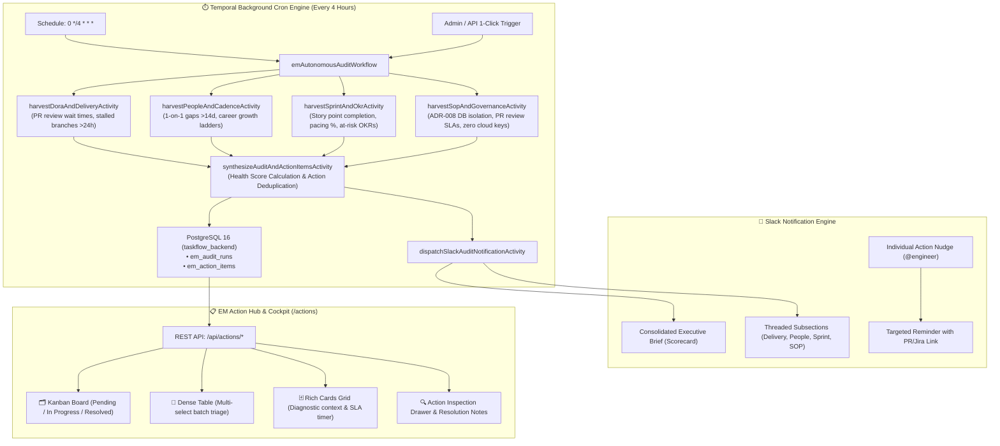

# Autonomous EM Task & Health Audit Engine & Interactive Action Hub Operations

This skill outlines operational procedures, architecture blueprints, database persistence rules, Slack notification modes, and troubleshooting steps for managing the **Autonomous EM Task & Health Audit Engine** and the **Interactive EM Action Hub** in EM TaskFlow AI.

---

## 🏗️ Architecture Blueprint

The Autonomous EM Task & Health Audit Engine runs on a **4-Hour Durable Cron Schedule** (`0 */4 * * *`) powered by **Temporal**, continuously inspecting all 10 domain micro-agents and MCP tools, synthesizing engineering action items, calculating an overall **Engineering Health Score (0–100%)**, and dispatching rich executive briefings to **Slack** with direct links to the **EM Action Hub UI** (`/actions`).



---

## 🛡️ Core Operational Policies & Rules

1. **Rule of Database Per-Service Isolation (ADR-008)**:
   - All audit runs (`em_audit_runs`) and action items (`em_action_items`) MUST reside strictly in `taskflow_backend` (port 5432).
   - NEVER write action items or audit logs to `taskflow_ai` (vector storage) or `langfuse_db` (analytics port 5433).
   - In-memory fallback arrays (`inMemoryAuditRuns`, `inMemoryActionItems`) ensure backend endpoints NEVER fail or crash even if PostgreSQL is temporarily offline.

2. **Rule of Non-Blocking Slack Dispatch**:
   - Slack notifications must be dispatched with graceful fallback (`SIMULATED` status if `SLACK_BOT_TOKEN` is unconfigured).
   - A network error or timeout when posting to Slack must NEVER abort or fail the audit workflow or REST API responses.

3. **Rule of Deterministic Action Item Deduplication**:
   - Action item IDs must follow predictable deterministic patterns (e.g. `act_pr_42`, `act_1on1_sarah_chen`, `act_okr_dora`) to prevent duplicate cards during successive 4-hour cron runs.

4. **Health Score Calculation Formula**:
   $$\text{Health Score} = \max\left(20, \min\left(100, 100 - (10 \times N_{\text{critical}}) - (5 \times N_{\text{warning}})\right)\right)$$
   - *Critical triggers*: Stalled PR >36 hours, blocked Jira ticket >3 days, severe SOP violation.
   - *Warning triggers*: Stalled PR >24 hours, overdue 1-on-1 >14 days, at-risk OKR pacing.

---

## 💬 Slack Notification Modes

### 1. Consolidated Executive Brief (`mode: 'consolidated'`)
Posts a single high-impact executive summary scorecard containing:
- Engineering Health Score pill (`🟢 92/100`)
- DORA Performer Tier (`Elite`), Sprint Pacing (`79%`), and SOP Compliance (`100%`)
- Overdue 1-on-1 count and total pending action items
- Top 4 prioritized action items with severity emojis (`🚨`, `⚠️`, `ℹ️`) and assignee handles
- Direct clickable link to the EM Action Hub: `<http://localhost:3000/actions|Open Action Hub ↗>`

### 2. Threaded Subsection Breakdown (`mode: 'threaded_subsections'`)
Posts the Consolidated Executive Brief as the parent message, accompanied by 4 threaded replies:
1. 🚀 **Delivery & DORA Metrics**: Open PR count, review wait times, MTTR, deployment frequency.
2. 👥 **People, 1-on-1s & Growth**: 1-on-1 cadence health, overdue syncs (>14d), career milestone targets.
3. 🎯 **Sprint Velocity & OKR Pacing**: Story points burn-down, pacing percentage, on-track vs at-risk objectives.
4. 🛡️ **SOP, ADR & Governance Compliance**: ADR-008 DB isolation status, PR size limits (<300 lines), zero cloud keys.

### 3. Individual Action Item Nudge
Allows the EM to click **"💬 Nudge"** on any action item to send a targeted reminder to the assigned engineer on Slack with the PR/Jira reference link and suggested next action.

---

## 🗂️ Interactive EM Action Hub UI (`/actions`)

The Action Hub provides an elite, industry-standard cockpit for Engineering Managers:

| View Mode | Best Used For | Features |
| :--- | :--- | :--- |
| **🗂️ Kanban Board** | Daily Standup & Workflow Triage | 3 swimlanes (`Pending Triage`, `In Progress`, `Resolved / Completed`) with 1-click movement buttons (**⏳ In Progress**, **✅ Mark Done**, **🚫 Dismiss**). |
| **📑 Dense Table** | High-Volume Review & Bulk Operations | Linear/Jira-style table with multi-select checkboxes for batch actions: **"✅ Mark Completed (N)"**, **"🚫 Dismiss (N)"**, **"💬 Share Selected to Slack"**. |
| **🃏 Rich Card Grid** | Deep Diagnostic Inspection | Detailed cards with origin badges (GitHub, Jira, GCal, Notion), SLA countdown, and suggested EM talking points. |

### Additional Cockpit Tabs:
- **🛡️ SOP & Architecture Matrix**: Live verification of ADR-008 DB isolation, PR review SLAs, and zero cloud keys.
- **👥 Team Cadence & People Pulse**: Engineer 1-on-1 matrix tracking tenure, career level targets (`L4 Mid → L5 Senior`), and overdue cadence warnings (`⚠️ OVERDUE - 16 Days Ago`).
- **📊 Sprint & DORA Velocity**: DORA 4 metrics with 2024 State of DevOps rubric tier ratings (*Elite*, *High*, *Medium*, *Low*).
- **⏱️ Audit Run History**: Historical timeline of cron runs with health score diffs.

---

## 📡 REST API Reference (`/api/actions`)

| Method | Endpoint | Description |
| :--- | :--- | :--- |
| `GET` | `/api/actions` | List action items (filterable by `status`, `category`, `severity`, `assignee`). |
| `GET` | `/api/actions/summary` | Aggregated counters (total, pending, in-progress, completed, critical, health score). |
| `GET` | `/api/actions/sop/compliance` | Live ADR-008 & engineering SOP compliance checklist and score. |
| `PATCH` | `/api/actions/:id` | Update status (`IN_PROGRESS`, `COMPLETED`, `DISMISSED`) with resolution notes. |
| `POST` | `/api/actions/audit/trigger` | Trigger immediate on-demand audit via Temporal or in-process fallback. |
| `GET` | `/api/actions/audit-runs` | List historical audit runs. |
| `GET` | `/api/actions/slack/channels` | List accessible Slack channels for EM dropdown selector. |
| `POST` | `/api/actions/slack/dispatch` | Dispatch executive briefing to Slack in Consolidated or Threaded mode. |
| `POST` | `/api/actions/:id/nudge` | Send targeted Slack nudge to engineer assigned to an action item. |
| `POST` | `/api/actions/batch` | Bulk update action item statuses or batch dispatch to Slack. |
| `GET` | `/api/admin/audit/status` | Retrieve latest audit score and 4-hour cron schedule status. |

---

## 🧪 Verification & Operational Commands

### 1. Execute Backend Unit Test Suite (300 specs)
```bash
cd backend
npm test
```

### 2. Run Specific Audit Specs
```bash
cd backend
npx jasmine test/temporal/emAutonomousAudit.spec.js test/routes/actionsRoute.spec.js
```

### 3. Trigger Manual Audit via cURL
```bash
curl -X POST http://localhost:4000/api/actions/audit/trigger \
  -H "Content-Type: application/json" \
  -d '{"mode": "consolidated", "channel": "#engineering-leadership"}'
```

### 4. Dispatch Briefing to Slack via cURL
```bash
curl -X POST http://localhost:4000/api/actions/slack/dispatch \
  -H "Content-Type: application/json" \
  -d '{"channel": "#engineering-leadership", "mode": "threaded_subsections", "customNote": "EM Weekly Review"}'
```
