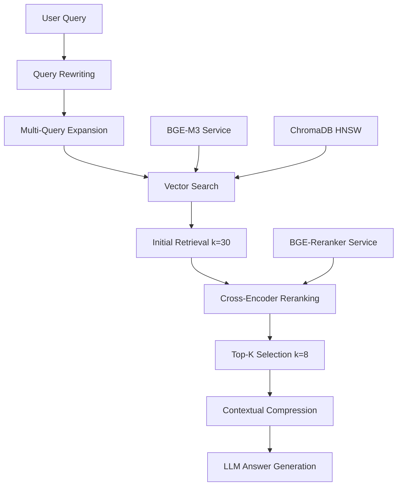

# Enhanced Agentic RAG System

EM-Taskflow now features a state-of-the-art **Agentic RAG** system that combines the best practices in retrieval-augmented generation with production-ready optimizations.

## 🎯 Key Features

### 1. **Token-Aware Recursive Chunking** ✅
- **Smart Chunking**: Uses LangChain's `TokenTextSplitter` for precise token-aware chunking (800 tokens per chunk)
- **Intelligent Overlaps**: 150-token overlaps to preserve context across chunk boundaries  
- **Structure Preservation**: Respects sentence boundaries and document structure
- **Enhanced Metadata**: Automatic chunk type classification (content, summary, introduction, structured)

### 2. **BGE-M3 Embeddings** ✅
- **Production-Ready**: Python microservice using `BAAI/bge-m3` model
- **Multilingual Support**: Handles 100+ languages with superior semantic understanding
- **Fallback**: Graceful fallback to Ollama `nomic-embed-text` when microservice unavailable
- **Batch Processing**: Efficient handling of large document collections

### 3. **BGE-Reranker-v2-M3 Cross-Encoder** ✅
- **High-Quality Reranking**: Cross-encoder model for precise relevance scoring
- **Production Microservice**: FastAPI service on port 8002
- **Smart Batching**: Handles large document sets with automatic batching
- **Fallback**: Lexical similarity reranking when microservice unavailable

### 4. **Contextual Compression** ✅
- **Intelligent Filtering**: Removes irrelevant content while preserving key information
- **Relevance Scoring**: Keyword-based relevance assessment
- **Content Truncation**: Smart truncation preserving important document sections
- **Metadata Enhancement**: Adds compression scores for transparency

### 5. **Multi-Query Expansion** ✅
- **Query Rewriting**: LLM-powered generation of alternative query phrasings
- **Semantic Diversity**: Different angles and terminology for comprehensive retrieval
- **Configurable**: Control number of query variants (default: 3)
- **Deduplication**: Smart removal of duplicate results across queries

### 6. **ChromaDB HNSW Optimization** ✅
- **Enhanced Configuration**: Optimized HNSW parameters for better performance
- **Cosine Similarity**: Normalized vectors for consistent similarity calculations
- **Collection Persistence**: Proper collection management with metadata
- **Custom Parameters**: `construction_ef: 200`, `M: 16`, `search_ef: 100`

## 🛠 Architecture



## 🚀 Quick Start

### 1. Start Python Microservices

```bash
# Start BGE-M3 Embeddings and BGE-Reranker services
cd python-services
./start-services.sh
```

This will:
- Create Python virtual environments
- Install BGE-M3 and BGE-Reranker-v2-M3 models
- Start services on ports 8001 (embeddings) and 8002 (reranker)
- Perform health checks

### 2. Upload Documents

```bash
# Upload PDF with enhanced processing
curl -X POST http://localhost:4000/api/agentic-rag/upload-pdf \
  -F "pdf=@document.pdf"
```

### 3. Query with Agentic RAG

```bash
# Full agentic pipeline
curl -X POST http://localhost:4000/api/agentic-rag/query \
  -H "Content-Type: application/json" \
  -d '{
    "query": "What are the key findings?",
    "enableQueryRewriting": true,
    "enableCompression": true,
    "enableReranking": true
  }'
```

## 📊 API Endpoints

### Document Processing

- `POST /api/agentic-rag/upload-pdf` - Upload PDF with enhanced processing
- `GET /api/agentic-rag/status` - Service status and capabilities

### Querying

- `POST /api/agentic-rag/query` - Full agentic RAG pipeline
- `POST /api/agentic-rag/search` - Document search without answer generation

### Microservice Management

- `GET /api/agentic-rag/microservices` - BGE services status
- `POST /api/agentic-rag/test-embeddings` - Test BGE-M3 directly
- `POST /api/agentic-rag/test-reranker` - Test BGE-Reranker directly

## ⚙️ Configuration

### Service Ports

- **BGE-M3 Embeddings**: `http://localhost:8001`
- **BGE-Reranker-v2-M3**: `http://localhost:8002`
- **ChromaDB**: `http://localhost:8000`
- **Backend API**: `http://localhost:4000`

### Chunking Parameters

```typescript
const CHUNK_SIZE = 800;        // tokens per chunk
const CHUNK_OVERLAP = 150;     // token overlap
const MAX_RETRIEVAL_K = 30;    // initial retrieval
const FINAL_K = 8;             // final results
```

### HNSW Configuration

```json
{
  "hnsw:space": "cosine",
  "hnsw:construction_ef": 200,
  "hnsw:M": 16,
  "hnsw:search_ef": 100
}
```

## 🧪 Testing

### Health Checks

```bash
# Check all services
curl http://localhost:8001/health  # BGE-M3 Embeddings
curl http://localhost:8002/health  # BGE-Reranker
curl http://localhost:4000/api/agentic-rag/status  # Main service
```

### Test Embeddings

```bash
curl -X POST http://localhost:8001/embed \
  -H "Content-Type: application/json" \
  -d '{"texts": ["Hello world", "Machine learning"], "normalize": true}'
```

### Test Reranking

```bash
curl -X POST http://localhost:8002/rerank \
  -H "Content-Type: application/json" \
  -d '{
    "query": "machine learning",
    "documents": [
      {"content": "AI and ML are related fields"},
      {"content": "Cooking recipes and ingredients"}
    ],
    "top_k": 2
  }'
```

## 📈 Performance Features

### Batch Processing
- **Embeddings**: Auto-batching for large text collections (batch size: 50)
- **Reranking**: Multi-stage reranking for document sets >50

### Caching & Optimization
- **Vector Normalization**: Consistent similarity calculations
- **Smart Deduplication**: Content-based duplicate removal
- **Efficient Retrieval**: MMR (Maximum Marginal Relevance) for diversity

### Fallback Strategies
- **BGE-M3 → Ollama**: Seamless fallback for embeddings
- **BGE-Reranker → Lexical**: Graceful degradation for reranking
- **Contextual Compression**: Simplified compression when LLM unavailable

## 🔧 Troubleshooting

### Python Services Not Starting

```bash
# Check Python version (requires 3.8+)
python3 --version

# Manual setup
cd python-services/embeddings
python3 -m venv venv
source venv/bin/activate
pip install -r requirements.txt
python app.py
```

### Memory Issues

BGE models require significant memory:
- **BGE-M3**: ~2GB RAM
- **BGE-Reranker-v2-M3**: ~1GB RAM

Consider using smaller fallback models for resource-constrained environments.

### Service Dependencies

The enhanced RAG system requires:
1. **ChromaDB** (vector storage)
2. **Ollama** (fallback embeddings + LLM)
3. **Python services** (optimal performance)
4. **Backend API** (orchestration)

Start services in order for best results.

## 🎯 Next Steps

The current implementation provides a solid foundation. Future enhancements could include:

1. **Hybrid Search**: Combining semantic + lexical search
2. **Query Classification**: Route queries to specialized retrievers
3. **Response Evaluation**: Automatic quality scoring
4. **Caching Layer**: Redis for frequently accessed embeddings
5. **Monitoring**: Detailed performance metrics and logging

## 📚 References

- [BGE-M3 Model](https://huggingface.co/BAAI/bge-m3)
- [BGE-Reranker-v2-M3](https://huggingface.co/BAAI/bge-reranker-v2-m3)
- [LangChain RAG](https://python.langchain.com/docs/use_cases/question_answering)
- [ChromaDB Documentation](https://docs.trychroma.com/)
- [LangGraph Agentic RAG](https://langchain-ai.github.io/langgraph/tutorials/rag/langgraph_agentic_rag/)