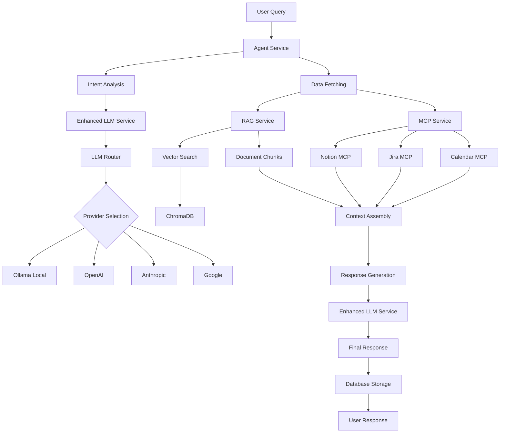
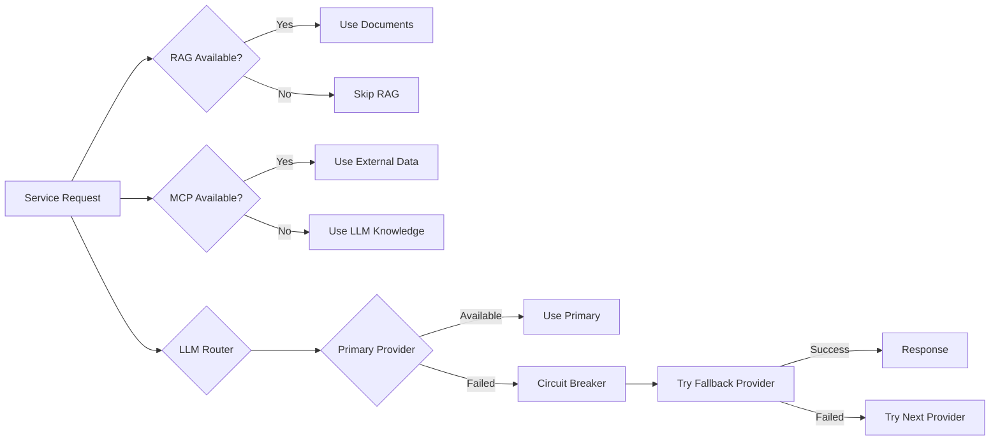

# EM TaskFlow

[](https://github.com/logsv/em-taskflow-ai/actions/workflows/backend-ci.yml)
[](https://github.com/logsv/em-taskflow-ai/actions/workflows/test.yml)
[](https://codecov.io/gh/logsv/em-taskflow-ai)

## Overview
EM TaskFlow is an advanced AI-powered productivity platform that combines **Retrieval-Augmented Generation (RAG)**, **Model Context Protocol (MCP)** integrations, and **intelligent LLM routing** to provide a comprehensive task management and knowledge assistant. The system processes your PDF documents, integrates with external services like Jira, Google Calendar, and Notion, and uses sophisticated AI agents to provide contextual, actionable responses.

### 🏗️ Architecture Overview
EM TaskFlow employs a multi-layered architecture:
- **Agent Service**: Orchestrates intent analysis, data fetching, and response generation
- **LLM Router**: Manages multiple LLM providers with load balancing, circuit breakers, and failover
- **RAG Service**: Processes documents and performs semantic search using vector embeddings
- **MCP Service**: Connects to external tools and services via Model Context Protocol
- **Enhanced LLM Service**: Provides advanced completion capabilities with metadata

## 🚀 Key Features

### 📚 Advanced RAG (Retrieval-Augmented Generation)
- **Document Processing**: Intelligent PDF parsing with chunk optimization
- **Vector Search**: Semantic search using Ollama embeddings and ChromaDB
- **Context Integration**: Seamlessly combines document context with LLM responses
- **Multi-source Knowledge**: Supports multiple document sources with metadata tracking

### 🔗 MCP (Model Context Protocol) Integration
- **Notion Integration**: Access and manage Notion pages, databases, and content
- **Jira/Atlassian Tools**: Query tickets, projects, and workflow data
- **Google Calendar**: Retrieve and manage calendar events and scheduling
- **Extensible Architecture**: Easy addition of new MCP servers and tools

### 🧠 Intelligent LLM Router
- **Multi-Provider Support**: OpenAI, Anthropic, Google Gemini, and local Ollama
- **Load Balancing**: Round-robin and cost-priority routing strategies
- **Circuit Breakers**: Automatic failover when providers are unavailable
- **Rate Limiting**: Configurable request throttling and concurrency control
- **Retry Logic**: Exponential backoff with configurable retry policies

### 🤖 AI Agent System
- **Intent Analysis**: Automatically determines user intent and required data sources
- **Contextual Responses**: Combines RAG results, MCP data, and LLM knowledge
- **Graceful Fallback**: Continues operation even when external services are unavailable
- **Conversation Memory**: Maintains chat history with database persistence

### 💻 Technical Excellence
- **TypeScript Backend**: Full type safety and modern ES modules
- **Comprehensive Testing**: 42%+ code coverage with unit and integration tests
- **CI/CD Pipeline**: Automated testing, coverage reporting, and deployment
- **Local-First**: Privacy-focused with local LLM and vector storage options

---

## Setup Instructions

### 1. Prerequisites
- **Node.js** (v16+ recommended)
- **Python 3.8+** (for Chroma)
- **Ollama** (installed and running locally)
- **ChromaDB** (Python package, running as a local service)

### 2. Install Dependencies

#### Backend
```sh
cd backend
npm install
```

#### Frontend
```sh
cd ../frontend
npm install
```

#### Chroma (Vector DB)
```sh
pip install chromadb
```

### 3. Build TypeScript Backend

#### Compile TypeScript
```sh
cd backend
npm run build
```

### 4. Start Services

#### Start Ollama (LLM & Embeddings)
- Make sure you have Ollama installed: https://ollama.com/
- Start Ollama:
  ```sh
  ./start-ollama.sh
  ```
- Pull required models:
  ```sh
  ollama pull mistral:latest
  ollama pull nomic-embed-text
  ```

#### Start Chroma (Vector DB)
```sh
chromadb run --path ./chroma-data
```

#### Start Backend
```sh
cd backend
npm start
```

#### Start Frontend
```sh
cd ../frontend
npm start
```

#### All Services (Convenience Scripts)
- **Start all services (Ollama, Chroma, Backend, Frontend):**
  ```sh
  ./start.sh
  ```
- **Stop all running services:**
  ```sh
  ./stop.sh
  ```
- **Manage individual services (start/stop/restart):**
  ```sh
  ./manage-services.sh
  ```

---

## 🏗️ Technical Architecture

### 🧠 LLM Router System

The LLM Router provides intelligent routing across multiple LLM providers with enterprise-grade reliability features:

#### **Multi-Provider Support**
- **OpenAI**: GPT-3.5, GPT-4, GPT-4 Turbo
- **Anthropic**: Claude-2, Claude-3 series
- **Google**: Gemini Pro
- **Ollama**: Local models (Mistral, Llama2, etc.)

#### **Load Balancing Strategies**
```yaml
# Configuration: backend/config/llm-router.yaml
loadBalancingStrategy: round_robin | cost_priority_round_robin
```

- **Round Robin**: Equal distribution across available providers
- **Cost Priority**: Routes based on cost efficiency and provider priority

#### **Reliability Features**
- **Circuit Breakers**: Automatic failover when providers fail
  - Configurable failure thresholds (default: 5 failures)
  - Automatic recovery after timeout periods
- **Retry Logic**: Exponential backoff with configurable parameters
  - Max attempts, initial delay, backoff factor
- **Rate Limiting**: Per-provider request throttling
  - Concurrent request limits
  - Token-per-second rate limiting

#### **Configuration Example**
```yaml
providers:
  - name: ollama-local
    type: ollama
    enabled: true
    priority: 1
    baseUrl: http://localhost:11434
    models:
      - name: mistral:latest
        costPer1kInputTokens: 0
        costPer1kOutputTokens: 0
        maxTokens: 4096
    circuitBreaker:
      failureThreshold: 3
      successThreshold: 2
      timeout: 30000
    retry:
      maxAttempts: 2
      initialDelay: 500
      maxDelay: 10000
      factor: 1.5
```

### 🔗 MCP (Model Context Protocol) Integration

The MCP Service connects to external tools and services using the Model Context Protocol standard:

#### **Supported Integrations**
- **Notion MCP Server**: Official Notion integration
  - Access pages, databases, and content
  - Create and update Notion resources
- **Google Calendar MCP**: Calendar management
  - Query events and scheduling information
  - Create and manage calendar entries
- **Jira Context MCP**: Project management integration
  - Query tickets, projects, and workflows
  - Access Atlassian ecosystem data

#### **MCP Architecture**
```typescript
// MCP Service Configuration
const mcpClient = new MultiServerMCPClient({
  throwOnLoadError: false,
  prefixToolNameWithServerName: true,
  useStandardContentBlocks: true,
  mcpServers: {
    notion: {
      transport: 'stdio',
      command: 'npx',
      args: ['-y', '@notionhq/notion-mcp-server'],
      env: {
        NOTION_API_KEY: process.env.NOTION_API_KEY,
        NOTION_VERSION: '2022-06-28'
      }
    }
    // Additional servers...
  }
});
```

#### **Environment Variables**
```bash
# Notion Integration
NOTION_API_KEY=your_notion_api_key
NOTION_VERSION=2022-06-28

# Google Calendar
GOOGLE_OAUTH_CREDENTIALS=your_oauth_credentials
GOOGLE_CALENDAR_ID=primary

# Jira Integration
JIRA_URL=your_jira_instance_url
JIRA_USERNAME=your_username
JIRA_API_TOKEN=your_api_token
JIRA_PROJECT_KEY=your_project_key
```

### 📚 RAG (Retrieval-Augmented Generation) System

The RAG Service provides intelligent document processing and semantic search capabilities:

#### **Document Processing Pipeline**
1. **PDF Parsing**: Extracts text content from uploaded PDFs
2. **Intelligent Chunking**: Splits documents into semantic chunks (~1000 chars)
3. **Embedding Generation**: Creates vector embeddings using Ollama
4. **Vector Storage**: Stores embeddings in ChromaDB with metadata

#### **Vector Search Process**
```typescript
// RAG Search Flow
const ragResults = await ragService.searchRelevantChunks(query, topK=5);
// Returns: chunks, context, sources with similarity scores
```

#### **Key Features**
- **Semantic Search**: Uses `nomic-embed-text` model for embeddings
- **Context Integration**: Combines multiple document chunks
- **Source Attribution**: Tracks document sources and chunk locations
- **Metadata Preservation**: Maintains filename, page numbers, and chunk indices

#### **ChromaDB Integration**
```python
# Vector Database Operations
collection = chroma_client.create_collection(
    name="pdf_chunks",
    metadata={"description": "PDF document chunks for RAG search"}
)

# Store document chunks with embeddings
collection.add(
    documents=[chunk_text],
    metadatas=[{"filename": "doc.pdf", "chunk_index": 0}],
    ids=[chunk_id],
    embeddings=[embedding_vector]
)
```

### 🤖 AI Agent System

The Agent Service orchestrates the entire AI workflow:

#### **Intent Analysis**
```typescript
// Automatic intent classification
const intent = await analyzeIntent(userQuery);
// Returns: intent category, required data sources, reasoning
```

#### **Multi-Source Data Fetching**
- **RAG Search**: Retrieves relevant document chunks
- **MCP Tools**: Fetches data from external services
- **Graceful Fallback**: Continues with available data sources

#### **Response Generation**
- **Context Assembly**: Combines RAG results, MCP data, and LLM knowledge
- **Intelligent Prompting**: Adapts prompts based on available data
- **Source Attribution**: Provides clear source references

---

## 🔄 System Workflow

### **Complete Request Flow**


### **Component Interaction Flow**

1. **Query Reception**: User submits query through frontend
2. **Intent Analysis**: Agent Service analyzes query intent and determines required data sources
3. **Parallel Data Fetching**:
   - **RAG Search**: Searches vector database for relevant document chunks
   - **MCP Integration**: Queries external services (Notion, Jira, Calendar)
4. **LLM Routing**: Enhanced LLM Service routes requests through intelligent LLM Router
5. **Context Assembly**: Combines RAG results, MCP data, and system context
6. **Response Generation**: Generates contextual response using assembled data
7. **Persistence**: Stores conversation in database for future reference

### **Fallback & Resilience**



---

## Usage

### 🚀 Basic Usage
1. **Open the app in your browser** (usually at http://localhost:3000)
2. **Upload PDFs** in the PDF Upload view and wait for processing confirmation
3. **Switch to Chat** and ask questions - the system will use your documents and external integrations
4. **View Sources** for each answer to understand the information sources used

### 🔧 Advanced Configuration

#### **LLM Provider Setup**
```bash
# Add API keys for cloud providers (optional)
export OPENAI_API_KEY=your_openai_key
export ANTHROPIC_API_KEY=your_anthropic_key
export GOOGLE_API_KEY=your_google_key
```

#### **MCP Integration Setup**
```bash
# Configure external service credentials
export NOTION_API_KEY=your_notion_key
export JIRA_URL=https://your-domain.atlassian.net
export JIRA_API_TOKEN=your_jira_token
export GOOGLE_OAUTH_CREDENTIALS=your_oauth_json
```

#### **RAG Configuration**
- **Chunk Size**: Modify `maxChunkSize` in RAG service (default: 1000 chars)
- **Search Results**: Adjust `topK` parameter for search results (default: 5)
- **Embedding Model**: Configure in `ragService.ts` (default: `nomic-embed-text`)

---

## 🔍 System Status & Monitoring

### **Health Checks**
- **LLM Router**: Provider status, circuit breaker states, rate limiting
- **RAG Service**: Vector DB connectivity, embedding service availability
- **MCP Service**: External service connection status
- **Agent Service**: End-to-end workflow health

### **Logging & Debugging**
- Comprehensive console logging with emoji indicators
- Request/response tracking across all services
- Error handling with graceful degradation
- Performance metrics and timing information

---

## Notes
- **Privacy-First**: All processing can be done locally with Ollama and ChromaDB
- **Scalable**: Easily add new LLM providers, MCP servers, or document types
- **Fault-Tolerant**: System continues operating even when external services are unavailable
- **Production-Ready**: Comprehensive testing, CI/CD pipeline, and monitoring capabilities

## CI/CD Pipeline

This project includes a comprehensive CI/CD pipeline using GitHub Actions:

### 🚀 Automated Testing
- **Continuous Integration**: Automatically runs tests on every push and pull request
- **TypeScript Compilation**: Validates TypeScript code compilation
- **Code Coverage**: Generates and reports test coverage metrics
- **Multi-environment Support**: Handles external service dependencies gracefully

### 📊 Coverage Reporting
- Minimum coverage thresholds: 42% statements, 29% branches, 36% functions, 42% lines
- Coverage reports uploaded to Codecov (optional)
- PR comments with coverage summaries

### 🔧 Local CI Validation
Test the CI setup locally:
```bash
cd backend
./scripts/validate-ci.sh
```

### 📋 Workflow Files
- `.github/workflows/backend-ci.yml` - Comprehensive backend testing with coverage
- `.github/workflows/test.yml` - Simplified test execution
- `.github/workflows/ci.yml` - Main CI workflow with path-based triggers

For detailed CI/CD documentation, see [`.github/CICD.md`](.github/CICD.md).

---

## 🛠️ Troubleshooting

### **LLM Router Issues**
- **No providers available**: Check [`backend/config/llm-router.yaml`](backend/config/llm-router.yaml) configuration
- **Circuit breaker open**: Wait for timeout period or restart the service
- **Rate limiting**: Reduce request frequency or adjust rate limits in config
- **Provider authentication**: Verify API keys in environment variables

### **RAG Service Issues**
- **PDF upload fails**:
  - Check if `pdf-parse` module is installed: `npm install pdf-parse`
  - Verify ChromaDB is running: `chromadb run --path ./chroma-data`
  - Check backend logs for specific error messages
- **No search results**:
  - Ensure Ollama embedding service is running: `ollama pull nomic-embed-text`
  - Verify vector database connectivity
  - Check if documents were properly processed and stored
- **Embedding generation fails**:
  - Confirm Ollama is accessible at `http://localhost:11434`
  - Test embedding endpoint: `curl -X POST http://localhost:11434/api/embeddings -d '{"model":"nomic-embed-text","prompt":"test"}'`

### **MCP Integration Issues**
- **MCP servers not connecting**:
  - Verify environment variables are set correctly
  - Check MCP server installation: `npx -y @notionhq/notion-mcp-server --version`
  - Review server logs for connection errors
- **Notion integration fails**:
  - Validate `NOTION_API_KEY` has proper permissions
  - Ensure Notion integration is properly configured in your workspace
- **Jira integration issues**:
  - Verify `JIRA_URL`, `JIRA_USERNAME`, and `JIRA_API_TOKEN`
  - Check if Jira Context MCP server is built: `cd mcp-servers/jira-context-mcp && npm run build`
- **Google Calendar problems**:
  - Validate OAuth credentials format and permissions
  - Ensure calendar access is granted for the service account

### **Agent Service Issues**
- **Intent analysis fails**: Check if Enhanced LLM Service is properly initialized
- **Incomplete responses**: Verify all required services (RAG, MCP, LLM) are operational
- **Database errors**: Ensure SQLite database is accessible and writable

### **General Debugging**
- **Service status check**: Use health check endpoints to verify component status
- **Log analysis**: Check console output for service-specific error messages
- **Configuration validation**: Verify all YAML configuration files are properly formatted
- **Dependency issues**: Run `npm install` in both backend and frontend directories
- **Port conflicts**: Ensure required ports (3000, 8000, 11434, 8001) are available

### **Performance Issues**
- **Slow responses**:
  - Check LLM provider response times
  - Optimize chunk size in RAG configuration
  - Review circuit breaker and retry settings
- **Memory usage**:
  - Monitor ChromaDB memory consumption
  - Consider adjusting concurrent request limits
- **High CPU usage**:
  - Review Ollama model size and system requirements
  - Optimize embedding generation batch sizes

---

## 🔌 API Endpoints

### **Chat & RAG Endpoints**
- `POST /api/chat` - Process user queries with full AI agent workflow
- `POST /api/upload` - Upload and process PDF documents
- `GET /api/chat/history` - Retrieve chat conversation history
- `GET /api/summaries` - Get document summaries and metadata

### **System Status Endpoints**
- `GET /api/health` - Overall system health check
- `GET /api/status/llm` - LLM Router provider status
- `GET /api/status/rag` - RAG service and vector database status
- `GET /api/status/mcp` - MCP service and external integrations status

### **Configuration Endpoints**
- `GET /api/config/providers` - List available LLM providers
- `PUT /api/config/providers/:name` - Update provider configuration
- `GET /api/config/models` - List available models across all providers

---

## 🧪 Development & Testing

### **Running Tests**
```bash
# Backend tests with coverage
cd backend
npm test

# Run specific test suites
npm run test:services
npm run test:integration
npm run test:unit

# Frontend tests
cd frontend
npm test
```

### **Development Mode**
```bash
# Backend development with hot reload
cd backend
npm run dev

# Frontend development
cd frontend
npm start
```

### **Code Quality**
```bash
# TypeScript compilation check
npm run build

# Linting
npm run lint

# Code formatting
npm run format
```

### **Architecture Decisions**
- **TypeScript**: Full type safety across the entire backend
- **ES Modules**: Modern JavaScript module system
- **Microservices Pattern**: Loosely coupled, independently testable services
- **Circuit Breaker Pattern**: Resilient external service integration
- **Repository Pattern**: Clean data access layer abstraction
- **Factory Pattern**: Dynamic LLM provider instantiation

---

## 🤝 Contributing

### **Development Setup**
1. Fork the repository
2. Create a feature branch: `git checkout -b feature/amazing-feature`
3. Install dependencies: `npm install` (in both backend and frontend)
4. Make your changes and add tests
5. Ensure all tests pass: `npm test`
6. Commit your changes: `git commit -m 'Add amazing feature'`
7. Push to the branch: `git push origin feature/amazing-feature`
8. Open a Pull Request

### **Code Standards**
- **TypeScript**: Use strict type checking
- **Testing**: Maintain >40% code coverage
- **Documentation**: Update README for new features
- **Commit Messages**: Use conventional commit format
- **Code Style**: Follow existing patterns and ESLint rules

### **Adding New Features**

#### **New LLM Provider**
1. Implement provider in [`backend/src/services/llmProviders.ts`](backend/src/services/llmProviders.ts)
2. Add configuration schema in [`backend/src/types/config.ts`](backend/src/types/config.ts)
3. Update [`backend/config/llm-router.yaml`](backend/config/llm-router.yaml)
4. Add comprehensive tests

#### **New MCP Server**
1. Add server configuration in [`backend/src/services/mcpService.ts`](backend/src/services/mcpService.ts)
2. Update environment variable documentation
3. Add integration tests
4. Update troubleshooting guide

#### **RAG Enhancements**
1. Modify [`backend/src/services/ragService.ts`](backend/src/services/ragService.ts)
2. Update chunking or embedding logic
3. Add performance benchmarks
4. Update configuration documentation

---

## 📚 Additional Resources

### **Related Documentation**
- [Backend Technical Documentation](backend/README.md) - Detailed backend architecture
- [CI/CD Pipeline Documentation](.github/CICD.md) - Deployment and testing workflows
- [LLM Router Configuration Guide](backend/config/llm-router.yaml) - Provider setup examples

### **External Dependencies**
- [Ollama](https://ollama.com/) - Local LLM runtime
- [ChromaDB](https://www.trychroma.com/) - Vector database
- [Model Context Protocol](https://modelcontextprotocol.io/) - External tool integration standard
- [LangChain MCP Adapters](https://js.langchain.com/docs/integrations/tools/mcp) - MCP integration library

### **Community & Support**
- **Issues**: Report bugs and request features via GitHub Issues
- **Discussions**: Join community discussions for questions and ideas
- **Wiki**: Additional guides and tutorials (coming soon)
- **Changelog**: Track updates and breaking changes in releases

---

## 🏆 Acknowledgments

- **Ollama Team** - For providing excellent local LLM runtime
- **ChromaDB** - For the powerful vector database solution
- **Anthropic** - For the Model Context Protocol standard
- **LangChain** - For MCP adapter implementations
- **Open Source Community** - For the countless libraries and tools that make this possible

---

## License
MIT License - see [LICENSE](LICENSE) file for details.

**EM TaskFlow** - Empowering productivity through intelligent AI integration 🚀
