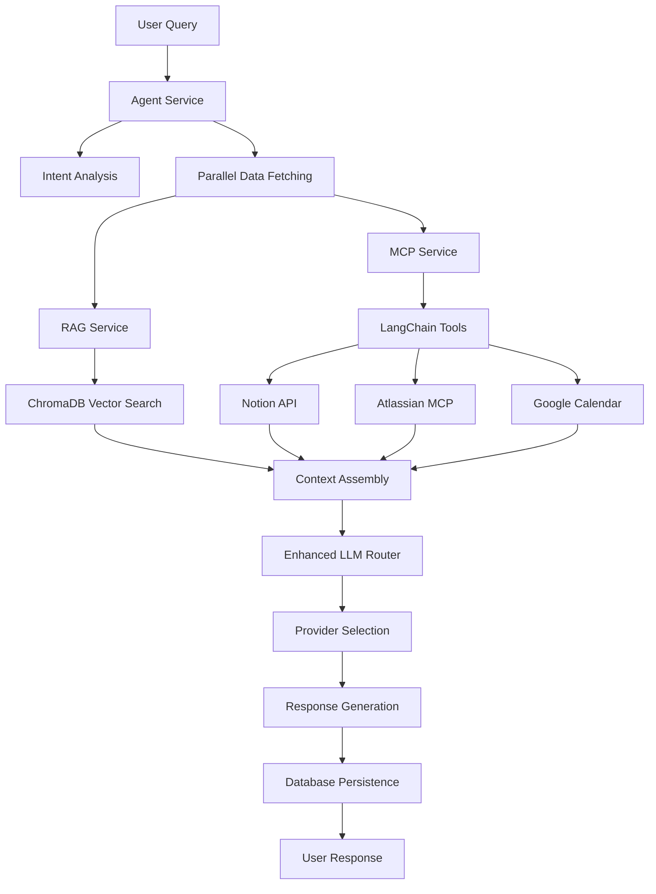

# EM TaskFlow

[](https://github.com/logsv/em-taskflow-ai/actions/workflows/backend-ci.yml)
[](https://github.com/logsv/em-taskflow-ai/actions/workflows/test.yml)
[](https://codecov.io/gh/logsv/em-taskflow-ai)

## Overview
EM TaskFlow is a **production-ready AI-powered productivity platform** that combines **Retrieval-Augmented Generation (RAG)**, **LangChain-native Model Context Protocol (MCP)** integrations, and **intelligent LLM routing** to provide a comprehensive task management and knowledge assistant. The system processes your PDF documents, integrates with external services like Notion, Jira, and Google Calendar, and uses sophisticated AI agents to provide contextual, actionable responses.

### 🏗️ Architecture Overview
EM TaskFlow employs a modern, production-ready architecture:
- **Reliable MCP Client**: Built on `@langchain/mcp-adapters` with automatic reconnection and health monitoring
- **Enhanced LLM Router**: Production-ready router using [llm-router](https://www.npmjs.com/package/llm-router) with resilience patterns
- **RAG Service**: Processes documents and performs semantic search using vector embeddings
- **Agent Service**: Orchestrates intent analysis, data fetching, and response generation
- **Type-Safe Configuration**: Zod-based configuration with environment variable validation

## 🚀 Key Features

### 🔗 Production-Ready MCP Integration
- **LangChain-Native**: Built on `@langchain/mcp-adapters` for maximum reliability
- **Multi-Server Support**: Handles multiple MCP servers with unified tool interface
- **Automatic Reconnection**: Built-in reconnection logic with exponential backoff
- **Health Monitoring**: Real-time server status and tool availability tracking
- **Notion Integration**: Official `@notionhq/notion-mcp-server` support
- **Atlassian Tools**: Reliable proxy via `mcp-remote` to official Atlassian MCP server
- **Google Calendar**: OAuth-based calendar management with maintained MCP servers

### 📚 Enhanced RAG (Retrieval-Augmented Generation)
- **LangGraph Integration**: Follows agentic RAG best practices with query transformation
- **Document Processing**: Intelligent PDF parsing with semantic chunking
- **Vector Search**: Semantic search using Ollama embeddings and ChromaDB
- **Context Integration**: Seamlessly combines document context with LLM responses
- **Quality Assurance**: Built-in hallucination detection and response regeneration

### 🧠 Production-Grade LLM Router
- **Multi-Provider Support**: OpenAI, Anthropic, Google Gemini, and local Ollama
- **Built on llm-router**: Production-ready npm package with enterprise features
- **Load Balancing**: Round-robin and cost-priority routing strategies
- **Circuit Breakers**: Automatic failover when providers are unavailable
- **Rate Limiting**: Configurable request throttling and concurrency control
- **Retry Logic**: Exponential backoff with configurable retry policies
- **Metrics Tracking**: Comprehensive request/response metrics and performance monitoring

### 🛡️ Enterprise-Grade Reliability
- **Type-Safe Configuration**: Zod-based validation with clear error messages
- **Health Monitoring**: Comprehensive service health checks and status reporting
- **Graceful Degradation**: Continues operation even when external services fail
- **Dependency Verification**: Startup health checks with clear troubleshooting guidance
- **Version Pinning**: Exact dependency versions prevent compatibility drift

### 💻 Technical Excellence
- **Modern TypeScript**: Full type safety with ES modules
- **Comprehensive Testing**: 42%+ code coverage with updated test suites
- **CI/CD Pipeline**: Automated testing, coverage reporting, and deployment
- **Local-First**: Privacy-focused with local LLM and vector storage options

---

## Setup Instructions

### 1. Prerequisites
- **Node.js v20.15.0+** (specified in `.nvmrc`)
- **Python 3.8+** (for ChromaDB)
- **Ollama** (installed and running locally)
- **ChromaDB** (Python package, running as a local service)

### 2. Install Dependencies

#### Backend (uses pnpm for exact dependency versions)
```sh
cd backend
pnpm install
```

#### Frontend
```sh
cd ../frontend
npm install
```

#### Chroma (Vector DB)
```sh
pip install chromadb
```

### 3. Configuration Setup

#### Create Configuration File
```sh
cd backend/src
cp config/local.example.json config/local.json
```

#### Configure Environment Variables (Optional)
```bash
# Override any config settings via environment variables
export NOTION_API_KEY=your_notion_api_key
export OPENAI_API_KEY=your_openai_key_optional
export ANTHROPIC_API_KEY=your_anthropic_key_optional
```

### 4. Build TypeScript Backend

#### Compile TypeScript
```sh
cd backend
npm run build
```

### 5. Start Services

#### Enhanced Startup (Recommended)
The enhanced startup script includes comprehensive health checks:
```sh
./start.sh
```

This will:
- ✅ Verify all system dependencies (Node.js, npm, pnpm, Ollama, Python)
- ✅ Check Node.js version compatibility
- ✅ Start all services with proper dependency order
- ✅ Wait for Ollama to be ready and verify required models
- ✅ Verify ChromaDB API connectivity
- ✅ Confirm backend health endpoint accessibility
- ✅ Run comprehensive health checks on all endpoints
- ✅ Provide clear URLs and troubleshooting guidance

#### Manual Service Management
```sh
# Individual service control
./manage-services.sh start
./manage-services.sh stop
./manage-services.sh restart
./manage-services.sh status
```

#### Required Ollama Models
The startup script automatically pulls required models:
```sh
ollama pull gpt-oss:latest
ollama pull nomic-embed-text
```

---

## 🏗️ Technical Architecture

### 🔗 Reliable MCP Integration

The MCP system has been completely rewritten for production reliability using `@langchain/mcp-adapters`:

#### **LangChain-Native Architecture**
```typescript
import { MultiServerMCPClient } from '@langchain/mcp-adapters';
import type { Tool } from '@langchain/core/tools';

// Reliable MCP client with built-in reconnection
const client = new MultiServerMCPClient(serverConfigs);
await client.initializeConnections();
const tools: Tool[] = await client.getTools();
```

#### **Production-Ready Features**
- **Automatic Reconnection**: Exponential backoff with configurable retry limits
- **Health Monitoring**: Real-time server status and tool availability
- **Multi-Server Orchestration**: Unified interface for multiple MCP servers
- **LangGraph Integration**: Native Tool[] objects for seamless LangGraph usage
- **Error Resilience**: Handles STDIO/SSE edge cases and authentication flows

#### **Supported MCP Servers**
```json
{
  "mcp": {
    "notion": {
      "enabled": true,
      "apiKey": "ntn_your_notion_api_key"
    },
    "jira": {
      "enabled": true,
      "url": "https://your-domain.atlassian.net",
      "username": "your@email.com",
      "apiToken": "your_jira_token",
      "projectKey": "PROJECT"
    },
    "google": {
      "enabled": false,
      "oauthCredentials": "./path/to/oauth.json",
      "calendarId": "primary"
    }
  }
}
```

#### **MCP Server Details**
- **Notion**: Official `@notionhq/notion-mcp-server` with API key authentication
- **Atlassian**: Via `mcp-remote` proxy to handle OAuth complexity automatically
- **Google Calendar**: Maintained MCP servers with OAuth support

### 🛡️ Type-Safe Configuration System

Replaced convict with Zod for better TypeScript integration:

#### **Environment Variable Validation**
```typescript
import { z } from 'zod';

const envSchema = z.object({
  NODE_ENV: z.enum(['development', 'test', 'production']).default('development'),
  NOTION_API_KEY: z.string().optional(),
  OPENAI_API_KEY: z.string().optional(),
  // ... comprehensive validation
});

// Automatic validation at startup with clear error messages
const config = envSchema.parse(process.env);
```

#### **Configuration Features**
- **Type Safety**: Full TypeScript support with auto-completion
- **Runtime Validation**: Validates configuration at startup
- **Clear Error Messages**: Helpful guidance for configuration issues
- **Environment Override**: Any setting can be overridden via environment variables
- **Single Source**: One JSON file replaces multiple YAML configurations

### 🧠 Enhanced LLM Router

Simplified and reliable LLM routing built on the proven `llm-router` package:

#### **Provider Configuration**
```json
{
  "llm": {
    "defaultProvider": "ollama",
    "defaultModel": "gpt-oss:latest",
    "loadBalancingStrategy": "round_robin",
    "providers": {
      "openai": {
        "enabled": false,
        "apiKey": "optional",
        "priority": 1
      },
      "ollama": {
        "enabled": true,
        "baseUrl": "http://localhost:11434",
        "priority": 4
      }
    }
  }
}
```

#### **Reliability Features**
- **Circuit Breakers**: Automatic failover with configurable thresholds
- **Retry Logic**: Exponential backoff for transient failures
- **Health Monitoring**: Real-time provider status tracking
- **Load Balancing**: Round-robin and cost-priority strategies

### 📚 RAG System Architecture

#### **Document Processing Pipeline**
1. **PDF Upload**: Secure file handling with validation
2. **Text Extraction**: Intelligent parsing with metadata preservation
3. **Semantic Chunking**: Context-aware splitting (~1000 chars)
4. **Vector Embedding**: Ollama `nomic-embed-text` model
5. **Storage**: ChromaDB with comprehensive metadata

#### **Search & Retrieval**
```typescript
const results = await ragService.searchRelevantChunks(query, 5);
// Returns: { chunks, context, sources, similarity_scores }
```

### 🤖 Agent System Workflow

#### **Complete Request Flow**


---

## Usage

### 🚀 Quick Start
1. **Run the enhanced startup script**: `./start.sh`
2. **Open your browser** to http://localhost:3000
3. **Upload PDFs** for document processing
4. **Configure MCP services** in `backend/src/config/local.json`
5. **Start chatting** - the system uses documents and external integrations

### 🔧 Configuration Guide

#### **MCP Service Setup**
```json
// backend/src/config/local.json
{
  "mcp": {
    "notion": {
      "enabled": true,
      "apiKey": "ntn_your_notion_integration_key"
    },
    "jira": {
      "enabled": true,
      "url": "https://your-company.atlassian.net",
      "username": "your@email.com",
      "apiToken": "your_jira_api_token",
      "projectKey": "PROJ"
    }
  }
}
```

#### **LLM Provider Setup**
```bash
# Optional: Add cloud provider API keys
export OPENAI_API_KEY=sk-your-openai-key
export ANTHROPIC_API_KEY=sk-ant-your-anthropic-key
```

### 📊 System Monitoring

#### **Health Check Endpoints**
- `GET /api/health` - Overall system health
- `GET /api/mcp-status` - Enhanced MCP service status with tool inventory
- `GET /api/llm-status` - LLM router and provider status

#### **Enhanced MCP Status Response**
```json
{
  "status": "success",
  "health": {
    "healthy": true,
    "servers": {
      "notion": { "connected": true, "toolCount": 12 },
      "atlassian": { "connected": true, "toolCount": 8 }
    },
    "totalTools": 20,
    "llmAvailable": true
  },
  "tools": [
    {
      "name": "notion_search_pages",
      "description": "Search Notion pages by title or content"
    }
  ]
}
```

---

## 🛠️ Development & Testing

### **Updated Test Suite**
The test suite has been completely updated for the new MCP implementation:

```bash
# Run comprehensive tests
cd backend
npm test

# Tests now validate:
# - New MCP service interface
# - Tool-based operations instead of agent-based
# - Health status monitoring
# - Configuration validation
```

### **Test Coverage**
- **MCP Service**: Tool execution, health monitoring, server status
- **Configuration**: Zod validation, environment variable handling
- **LLM Router**: Provider routing, health checks, error handling
- **Integration**: End-to-end workflow testing

### **Development Tools**
```bash
# Development with hot reload
npm run dev

# TypeScript compilation check
npm run build

# Configuration validation
node -e "import('./dist/config.js').then(c => console.log('✅ Config valid'))"
```

---

## 🔍 Troubleshooting

### **Enhanced Startup Diagnostics**
The new startup script provides comprehensive diagnostics:

#### **Dependency Verification**
- ✅ Node.js version compatibility (uses `.nvmrc`)
- ✅ Required commands available (npm, pnpm, ollama, python3)
- ✅ System information display

#### **Service Health Checks**
- ✅ Ollama API connectivity and model availability
- ✅ ChromaDB API endpoint verification
- ✅ Backend health endpoint validation
- ✅ Comprehensive service status reporting

#### **Common Issues & Solutions**

**MCP Connection Issues:**
```bash
# Check MCP service status
curl http://localhost:4000/api/mcp-status

# Verify Notion API key
export NOTION_API_KEY=ntn_your_key
./start.sh

# Test Atlassian connectivity
npx -y mcp-remote https://mcp.atlassian.com/v1/sse --help
```

**Configuration Problems:**
```bash
# Validate configuration
node -e "
import('./backend/dist/config.js').then(config => {
  console.log('✅ Configuration loaded successfully');
  console.log('MCP servers:', Object.keys(config.getMcpConfig()));
}).catch(err => {
  console.error('❌ Configuration error:', err.message);
});"
```

**Dependency Issues:**
```bash
# Rebuild native dependencies
cd backend
pnpm rebuild sqlite3

# Clear dependency cache
rm -rf node_modules pnpm-lock.yaml
pnpm install
```

---

## 🚀 Production Deployment

### **Production Readiness Checklist**
- ✅ **Dependency Pinning**: Exact versions prevent compatibility drift
- ✅ **Health Monitoring**: Comprehensive status endpoints
- ✅ **Error Handling**: Graceful degradation and clear error messages
- ✅ **Configuration Validation**: Startup validation with helpful guidance
- ✅ **Connection Resilience**: Automatic reconnection with backoff
- ✅ **Type Safety**: Full TypeScript coverage with runtime validation

### **Environment Configuration**
```bash
# Production environment variables
NODE_ENV=production
PORT=4000

# Required for MCP integrations
NOTION_API_KEY=ntn_production_key
JIRA_URL=https://company.atlassian.net
JIRA_API_TOKEN=production_token

# Optional LLM providers
OPENAI_API_KEY=sk-production-key
ANTHROPIC_API_KEY=sk-ant-production-key
```

### **Docker Deployment** (Coming Soon)
- Containerized deployment with health checks
- Multi-stage builds for optimized images
- Docker Compose for full-stack deployment

---

## 🤝 Contributing

### **Architecture Guidelines**
- **MCP Integration**: Use `@langchain/mcp-adapters` for all MCP functionality
- **Configuration**: Add new settings to Zod schema with validation
- **Error Handling**: Implement graceful degradation patterns
- **Testing**: Update tests for tool-based MCP operations
- **Type Safety**: Maintain full TypeScript coverage

### **Development Setup**
1. Fork and clone the repository
2. Install dependencies: `pnpm install` (backend), `npm install` (frontend)
3. Copy configuration: `cp backend/src/config/local.example.json backend/src/config/local.json`
4. Add your API keys to the config file
5. Run tests: `npm test`
6. Start development: `./start.sh`

---

## 📚 Additional Resources

### **Documentation**
- [LangChain MCP Adapters](https://js.langchain.com/docs/integrations/tools/mcp) - Official MCP integration
- [Model Context Protocol](https://modelcontextprotocol.io/) - MCP standard documentation
- [Ollama](https://ollama.com/) - Local LLM runtime
- [ChromaDB](https://www.trychroma.com/) - Vector database

### **Supported MCP Servers**
- [Notion MCP Server](https://github.com/notionhq/notion-mcp-server) - Official Notion integration
- [Atlassian MCP](https://mcp.atlassian.com/) - Official Atlassian MCP server
- [Google Calendar MCP](https://github.com/cocal/google-calendar-mcp) - Community calendar integration

---

## 🏆 Key Improvements in This Release

### **🔧 Reliability Enhancements**
- **Replaced mcp-use** with production-ready `@langchain/mcp-adapters`
- **Eliminated fragile dependencies** and connection handling issues
- **Added comprehensive health monitoring** with real-time status
- **Implemented automatic reconnection** with exponential backoff

### **⚡ Performance Improvements**
- **Reduced dependency overhead** by removing legacy packages
- **Optimized tool loading** with efficient caching
- **Streamlined configuration** with faster validation
- **Better resource management** with proper cleanup

### **🛡️ Production Readiness**
- **Type-safe configuration** with Zod validation
- **Comprehensive startup checks** with clear error guidance
- **Version pinning** prevents compatibility issues
- **Enhanced error handling** with graceful degradation

### **👩‍💻 Developer Experience**
- **Simplified architecture** with fewer abstraction layers
- **Clear documentation** with updated troubleshooting guides
- **Better debugging** with structured logging
- **Modern tooling** with latest TypeScript and ES modules

---

## License
MIT License - see [LICENSE](LICENSE) file for details.

**EM TaskFlow** - Production-ready AI productivity platform with reliable MCP integration 🚀