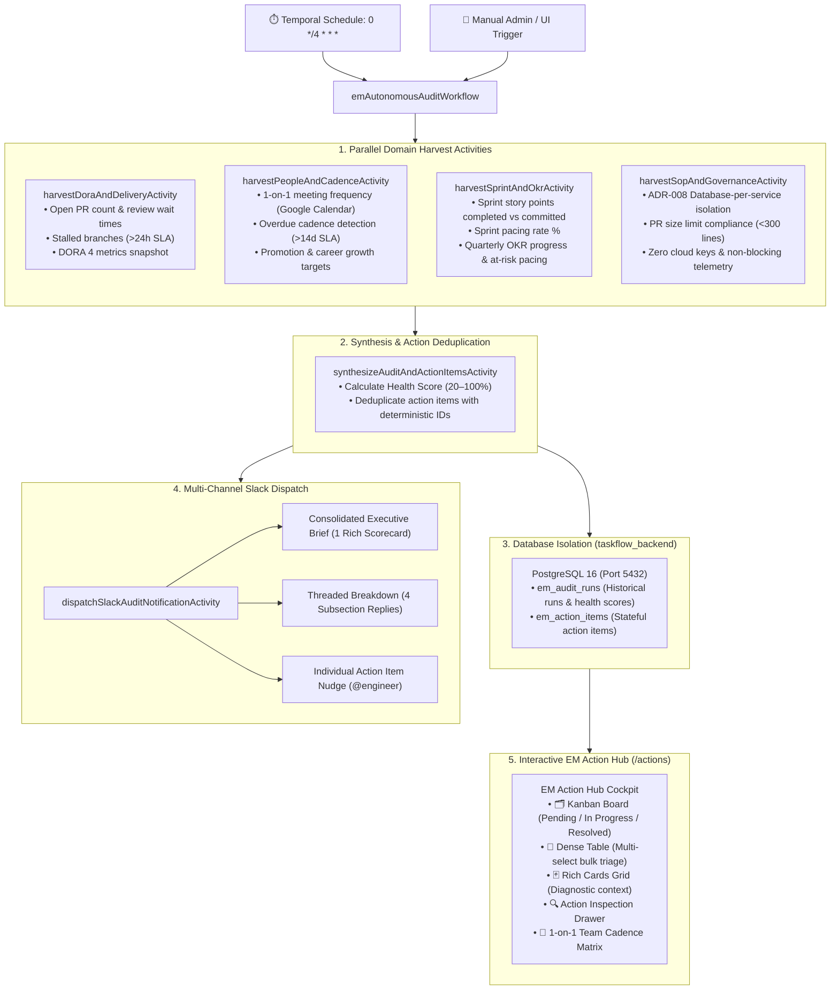

# ⏱️ Autonomous EM Audit Engine & Action Hub

The **Autonomous Engineering Manager (EM) Task & Health Audit Engine** provides continuous background health auditing, automated metric harvesting, Slack executive briefings, and an interactive multi-view **EM Action Hub** (`/actions`).

---

## 🏗️ Architecture Blueprint

The engine operates on a **4-Hour Durable Cron Schedule** (`0 */4 * * *`) powered by **Temporal**, orchestrating parallel harvest activities across 10 domain micro-agents and MCP tools (GitHub, Jira, Notion, Google Calendar, and Slack).

---

## 💚 Engineering Health Score Formula

The overall Engineering Health Score is calculated deterministically based on active blockers and warning signals:

$$\text{Health Score} = \max\left(20, \min\left(100, 100 - (10 \times N_{\text{critical}}) - (5 \times N_{\text{warning}})\right)\right)$$

### Penalty Triggers
- **🚨 Critical Penalty (-10 pts)**:
  - Pull requests waiting for review $>36\text{ hours}$.
  - Jira tickets blocked in sprint $>3\text{ days}$.
  - ADR-008 per-service database isolation failure or cloud key leakage.
- **⚠️ Warning Penalty (-5 pts)**:
  - Pull requests waiting for review $>24\text{ hours}$.
  - 1-on-1 meeting overdue $>14\text{ days}$.
  - OKR pacing score $<60\%$ for active quarterly deliverables.

---

## 💬 Multi-Channel Slack Dispatch Engine

The engine provides flexible Slack notification formats tailored for leadership and delivery teams:

### 1. Consolidated Executive Briefing (`mode: 'consolidated'`)
Sends a single high-impact scorecard message to `#engineering-leadership` or selected channels:
- Overall Engineering Health Score pill (`🟢 92/100`)
- DORA Performer Tier (`Elite`), Sprint Pacing (`79%`), and SOP Compliance (`100%`)
- Overdue 1-on-1 count and total pending action items
- Top 4 prioritized action items with severity badges and assignee handles
- Direct deep-link: `<http://localhost:3000/actions|Open in EM Action Hub ↗>`

### 2. Threaded Subsection Breakdown (`mode: 'threaded_subsections'`)
Dispatches the Consolidated Executive Brief as the parent message, followed by 4 detailed threaded replies:
1. 🚀 **Delivery & DORA Metrics**: Open PR count, review wait times, MTTR, deployment frequency.
2. 👥 **People, 1-on-1s & Growth**: 1-on-1 cadence health, overdue syncs (>14d), career level targets.
3. 🎯 **Sprint Velocity & OKR Pacing**: Story points burn-down, pacing percentage, on-track vs at-risk objectives.
4. 🛡️ **SOP, ADR & Governance Compliance**: ADR-008 DB isolation status, PR size limits (<300 lines), zero cloud keys.

### 3. Targeted Engineer Action Item Nudges
Allows the Engineering Manager to click **"💬 Nudge"** on any action item card or table row in the UI to dispatch a targeted reminder to the assigned engineer on Slack (`@alex-dev`, `@sarah-c`) with context, PR/Jira links, and suggested talking points.

---

## 🗂️ Multi-View Action Triage Modes (`/actions`)

The Action Hub UI provides multiple interactive view modes designed for speed and clarity:

| Mode | Visual Paradigm | Key Capabilities |
| :--- | :--- | :--- |
| **🗂️ Kanban Board** | 3-Column Workflow Board | Swimlanes: `Pending Triage` (amber), `In Progress` (blue), `Resolved / Completed` (green). 1-click status transitions (**⏳ In Progress**, **✅ Mark Done**, **🚫 Dismiss**). |
| **📑 Dense Table** | High-Density Data Grid | Linear/Jira-style table with multi-select checkboxes for batch triage (**"✅ Mark Completed (N)"**, **"🚫 Dismiss (N)"**, **"💬 Share Selected to Slack"**). |
| **🃏 Rich Cards Grid** | Diagnostic Cards | Origin badges (GitHub, Jira, GCal, Notion), SLA countdown timers, and suggested EM talking points. |

### Deep EM Cockpit Tabs
- **🛡️ SOP & Architecture Matrix**: Live verification of ADR-008 per-service isolation, PR review SLAs (<24h), and zero cloud keys.
- **👥 Team Cadence & People Pulse**: Engineer 1-on-1 cadence tracking matrix with tenure, career level targets (`L4 Mid → L5 Senior`), and overdue cadence warnings.
- **📊 Sprint & DORA Velocity**: DORA 4 metrics with 2024 State of DevOps rubric tier ratings (*Elite*, *High*, *Medium*, *Low*).
- **⏱️ Audit Run History**: Historical timeline of cron runs with health score diffs.

---

## 🛡️ Database Per-Service Isolation (ADR-008)

All audit state and action items are stored strictly in `taskflow_backend` (port 5432):
- **`em_audit_runs`**: Stores run timestamp, trigger type (`CRON`, `MANUAL`, `API`), health score, raw harvest payloads, and summary markdown.
- **`em_action_items`**: Stores stateful action items with deterministic IDs, severity (`CRITICAL`, `WARNING`, `INFO`), category, assignee, resolution notes, and resolver name.
- **In-Memory Fallbacks**: If PostgreSQL is offline, in-memory arrays (`inMemoryAuditRuns`, `inMemoryActionItems`) ensure zero downtime and uninterrupted UI operation.
