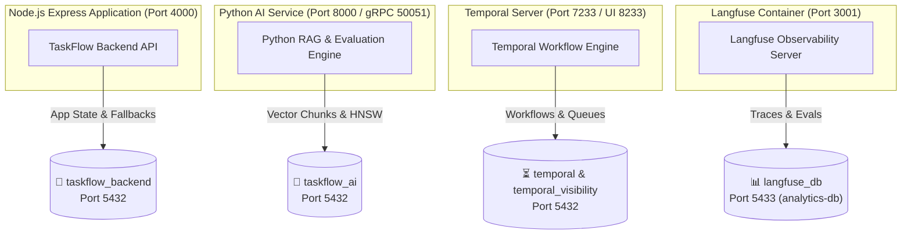

# Database Per-Service Isolation (ADR-008)

EM TaskFlow AI enforces strict **Database Per-Service Isolation** across 4 PostgreSQL database instances and isolated telemetry containers to prevent cross-domain pollution and ensure zero-downtime operations.

---

## 🗄️ Database Topology

---

## 🔒 Key & Credential Preservation Rules (STRICT)

1. **`app_settings` Immunity**:
   - `app_settings` in `taskflow_backend` houses live user API keys (`JIRA_API_TOKEN`, `GITHUB_TOKEN`, `NOTION_API_KEY`, `GOOGLE_CALENDAR_API_KEY`, `SLACK_BOT_TOKEN`) and Ollama model configs.
   - It is strictly forbidden to drop, truncate, or wipe `app_settings` during database cleanup, migration, or runtime resets.
2. **Real User Profile Immunity**:
   - Real user profiles (`logsv`, admin emails, lead engineering managers) in `team_members` are never deleted during test fixture cleanups or mock resets.
3. **Secret Masking**:
   - When updating settings via UI or API, existing masked secret fields (`******`) in PostgreSQL are always retained and never replaced with empty strings.
