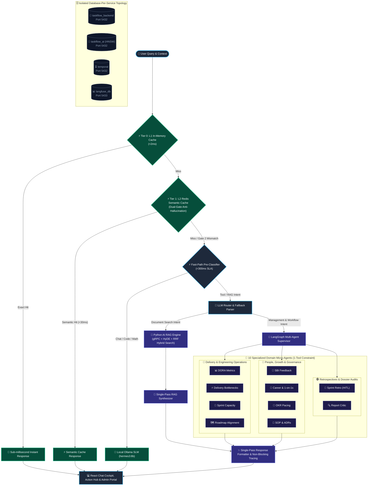

# High-Level Design & 8-Stage Workflow

EM TaskFlow AI utilizes an **8-stage hybrid multi-agent pipeline** optimized for local Small Language Models (SLMs). This architecture balances low latency, accurate tool dispatching, token compression, and database resiliency.

---

## 🏛️ System Architecture Diagram

---

## 🧭 The 8-Stage Execution Lifecycle

1. **Pre-LLM Preprocessing & Compression Stage**:
   - Compresses large file uploads ($>15\text{k}$ characters) via LangChain Map-Reduce.
   - Preserves 8 recent chat turns verbatim and state-anchors earlier turns into a compact Session Fact Matrix block.
2. **5-Tier Production Caching Suite**:
   - **Tier 0 L1 Exact Cache**: Normalized in-memory LRU cache ($<2\text{ms}$).
   - **Tier 1 L2 Semantic Redis Cache**: Dual-Gate verification (Gate 1 cosine $\ge 0.95$ + Gate 2 Strict Anti-Hallucination Entity Alignment filter) in $<30\text{ms}$.
   - **Tier 2 MCP Tool Cache**: Hash-keyed cache for read-only JQL, PRs, and pages.
3. **Fast-Path Classifier (<300ms)**:
   - High-priority pre-classifier intercepting pure math, coding scripts, conversational greetings, and direct attachment questions without routing overhead.
4. **LLM Router & Resilient JSON Fallback Parser**:
   - Analyzes domain intent across `VALID_DOMAINS`. Employs `parseStructuredDecision` to extract clean JSON even when the SLM injects markdown blocks.
5. **Single-Pass RAG Engine & Python AI Service Delegation**:
   - 100% of RAG operations execute in Python via gRPC (`ai_service_grpc.py`). Executes HyDE query transformation and Reciprocal Rank Fusion (RRF) against `taskflow_ai`. Formatter bypass skips secondary LLM formatting.
6. **LangGraph Multi-Agent Supervisor**:
   - Dispatches requests across 10 specialized domain micro-agents with bounded 1-tool execution.
7. **Multi-Source MCP Integrations & DB Fallback**:
   - Gathers live data from Jira, Notion, GitHub, Slack, and Google Calendar. Falls back to PostgreSQL cached snapshots if live endpoints are offline. Direct URL resolution eliminates fake domains.
8. **Single-Pass Structured Response Formatter & Non-Blocking Telemetry**:
   - Formats structured Markdown with executive summaries, GFM tables, and citations. Emits non-blocking telemetry traces to `langfuse_db` (port 5433).
