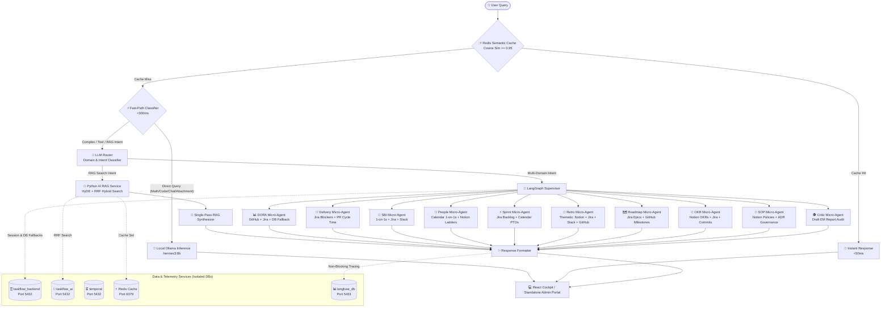

# High-Level Design & 8-Stage Workflow

EM TaskFlow AI utilizes an **8-stage hybrid multi-agent pipeline** optimized for local Small Language Models (SLMs). This architecture balances low latency, accurate tool dispatching, token compression, and database resiliency.

---

## 🏛️ System Architecture Diagram

---

## 🧭 The 8-Stage Execution Lifecycle

1. **Pre-LLM Preprocessing & Compression Stage**:
   - Compresses large file uploads ($>15\text{k}$ characters) via LangChain Map-Reduce.
   - Preserves 8 recent chat turns verbatim and state-anchors earlier turns.
2. **Redis Semantic Cache Check**:
   - Queries Redis vector similarity. If cosine similarity $\ge 0.95$, returns pre-computed responses in $<50\text{ms}$.
3. **Fast-Path Classifier (<300ms)**:
   - High-priority regex matcher intercepting pure math, coding scripts, conversational greetings, and direct attachment questions without routing overhead.
4. **LLM Router & Resilient JSON Parser**:
   - Analyzes intent across active domains. Employs `parseStructuredDecision` to extract clean JSON even when the SLM injects markdown blocks.
5. **Single-Pass RAG Engine**:
   - Executes HyDE query transformation and Reciprocal Rank Fusion (RRF) against `taskflow_ai`.
6. **LangGraph Multi-Agent Supervisor**:
   - Dispatches requests across 10 specialized domain micro-agents with bounded 1-tool execution.
7. **Multi-Source MCP Integrations & DB Fallback**:
   - Gathers live data from Jira, Notion, GitHub, Slack, and Google Calendar. Falls back to PostgreSQL cached snapshots if live endpoints are offline.
8. **Single-Pass Structured Response Formatter & Telemetry**:
   - Formats structured Markdown with executive summaries, GFM tables, and citations. Emits non-blocking telemetry traces to `langfuse_db` (port 5433).
