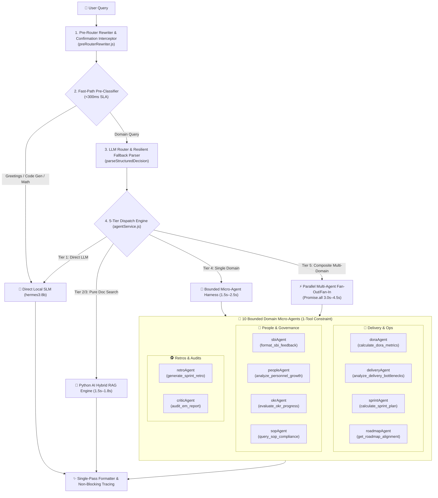

# LangGraph Multi-Agent Supervisor & Multi-Agent Architecture

EM TaskFlow AI utilizes `@langchain/langgraph-supervisor` to orchestrate 10 specialized domain micro-agents, implementing strict policy guardrails and multi-agent enhancements optimized for local Small Language Models (SLMs).

---

## 🏗️ Multi-Agent Architecture Diagram

---

## 🎯 The 1-Tool Sub-Agent Bounding Rule

### The Problem with Local SLMs
Small Language Models (3B to 8B parameter models like `hermes3:8b` or `mistral:7b`) suffer significant cognitive degradation and hallucination when presented with large tool schemas ($>5$ tools simultaneously).

### The Solution: 1 Bounded Tool per Sub-Agent
Each micro-agent in EM TaskFlow AI is architected as a specialized ReAct agent bounded to **strictly 1 deterministic tool definition**. This increases function-calling accuracy from $<65\%$ on multi-tool prompts to **$>95\%$** on local SLMs.

---

## 👥 The 10 Domain Micro-Agents Catalog

| Agent Name | Bounded Tool Name | Primary Data Sources | Core Capabilities |
| :--- | :--- | :--- | :--- |
| **`doraAgent`** | `calculate_dora_metrics` | GitHub REST + Jira Incidents + DB | DORA 4 metrics (Deploy Frequency, Lead Time, Failure Rate, MTTR) with tier ratings. |
| **`deliveryAgent`** | `analyze_delivery_bottlenecks` | Jira JQL + GitHub PR turnaround | Review cycle times, commit counts, and Jira blocker tickets. |
| **`sbiAgent`** | `format_sbi_feedback` | Jira tickets + 1-on-1s + Slack | Situation-Behavior-Impact constructive coaching scripts. |
| **`peopleAgent`** | `analyze_personnel_growth` | Google Calendar + Notion ladders | Career progression, 1-on-1 cadence, and skill competency gaps. |
| **`sprintAgent`** | `calculate_sprint_plan` | Jira Backlog + Calendar PTOs | Sprint capacity estimation and story point velocity. |
| **`retroAgent`** | `generate_sprint_retro` | Notion Retro + Jira + Slack + GitHub | Thematic clustering (*What Went Well*, *Areas for Improvement*, *Action Items*) with Temporal HITL approval for posting back to Slack. |
| **`roadmapAgent`** | `get_roadmap_alignment` | Jira Epics + GitHub Milestones + Notion | Milestone alignment, technical dependencies, and roadmap drift. |
| **`okrAgent`** | `evaluate_okr_progress` | Notion OKRs + Jira + Commits | Objectives & Key Results tracking and pacing scores. |
| **`sopAgent`** | `query_sop_compliance` | Notion Policies + ADRs + DB | Standard Operating Procedures, review SLAs, and ADR governance. |
| **`criticAgent`** | `audit_em_report` | Draft text + DB policies | Audits draft EM status reports, dossiers, and promotion packets. |

---

## ⚡ Multi-Agent Enhancements

### 1. Pre-Router Rewriter & Confirmation Interceptor (`preRouterRewriter.js`)
Intercepts multi-turn conversational confirmations (*"yes"*, *"proceed"*, *"sure"*, *"confirm"*), traversing message history to rehydrate the original user query and routing plan without losing context.

### 2. Fast-Path Pre-Classifier (`<300ms`)
Zero-latency classifier intercepting pure math, coding, greetings, and attachment questions, answering in $<300\text{ms}$ with zero tool overhead.

### 3. Resilient JSON Fallback Parser (`parseStructuredDecision`)
Extracts clean JSON decisions even when local SLMs output markdown backticks or commentary text.

### 4. 5-Tier Dispatch Pipeline & Parallel Fan-Out/Fan-In
- **Tier 1 (Fast-Path)**: $<300\text{ms}$ direct SLM output.
- **Tier 2/3 (Dedicated RAG)**: 1.5s–1.8s single-pass document retrieval.
- **Tier 4 (Direct Single-Domain)**: 1.5s–2.5s targeted micro-agent execution.
- **Tier 5 (Parallel Multi-Domain Fan-Out / Fan-In)**: Composite queries execute multiple domain harnesses in parallel (`Promise.all()`), aggregating results into an executive scorecard in 3.0s–4.5s.

### 5. `VALID_DOMAINS` Policy Alignment & Zero Misleading Fallbacks
- Synchronized domain sets eliminate false `unexpected_domains` policy violations.
- System never outputs fake hardcoded strings (such as fake `@logsv`), ensuring fallbacks accurately reflect real PostgreSQL snapshots.
- Direct API URL resolution (`urlHelper.js`) ensures valid deep-links to Jira and GitHub items.
