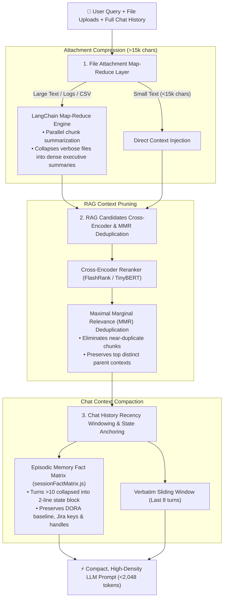

# 📦 Pre-LLM Preprocessing & Context Compression Suite

To maximize local SLM inference speed and accuracy on 8B parameter models, EM TaskFlow AI incorporates an intelligent **Pre-LLM Preprocessing & Compression Suite** that operates *before* queries reach the LangGraph supervisor or primary reasoning LLMs.

---

## 🏗️ The 3 Pre-LLM Optimization Layers

---

## 1. File Attachment Map-Reduce Compression

When users attach large files (e.g. 50-page architecture documents, raw CI/CD failure logs, or extensive CSV metrics):
- Files $>15,000\text{ characters}$ are split into token chunks.
- A local Map-Reduce process summarizes key decisions, blocker tickets, and rubric standards into structured 300-word executive briefs.
- Prevents context window overflows and eliminates prompt truncation on local 8B SLMs.

---

## 2. RAG Cross-Encoder Reranking & MMR Deduplication

Retrieved document chunks from hybrid dense/sparse search are refined before generation:
- **Cross-Encoder Scoring**: Re-scores candidate chunks with fine-grained query-document cross-attention.
- **Maximal Marginal Relevance (MMR)**: Penalizes redundant candidate chunks ($\lambda = 0.7$) to ensure diverse, non-repetitive knowledge injection.

---

## 3. Chat History Recency Windowing & Fact-Matrix State Anchoring

In long-running multi-turn sessions ($>10\text{ turns}$):
- The **last 8 turns** are retained verbatim in the prompt context.
- Historical turns are summarized into a concise **Session Fact Matrix** block managed by `sessionFactMatrix.js` and `episodicMemory.js`:
  - Active sprint IDs (`Sprint 42`)
  - Target engineer handles (`@alex-dev`, `@sarah-c`)
  - Referenced pull requests (`PR #89`)
  - Baseline DORA metric snapshots
- Keeps conversational token usage strictly under **2,048 tokens** regardless of session length, preventing local SLM context saturation and hallucinations.

---

## 4. Rule of Zero Misleading Fallbacks & Direct API URL Resolution

- **Zero Misleading Fallbacks**: When live tool endpoints are unavailable, the system never outputs hardcoded generic placeholder strings (such as fake `@logsv` or fake GitHub issues on non-GitHub queries). Fallbacks render actual PostgreSQL database snapshots or neutral status indicators.
- **Direct API URL Resolution (`urlHelper.js`)**: Resolves native API URLs directly from Jira and GitHub responses, preventing fake domains or broken links.

---

## 5. Fast-Path Classifier Interceptor (`<300ms`)

Mounted in [`backend/src/agent/llmRouter.js`](file:///Users/logsv/Documents/agent-dev/em-taskflow-ai/backend/src/agent/llmRouter.js):
- High-priority pre-classifier identifying conversational queries, math expressions, and direct code generation.
- Executes in **$<300\text{ms}$**, completely bypassing tool execution harnesses and RAG search overhead.
