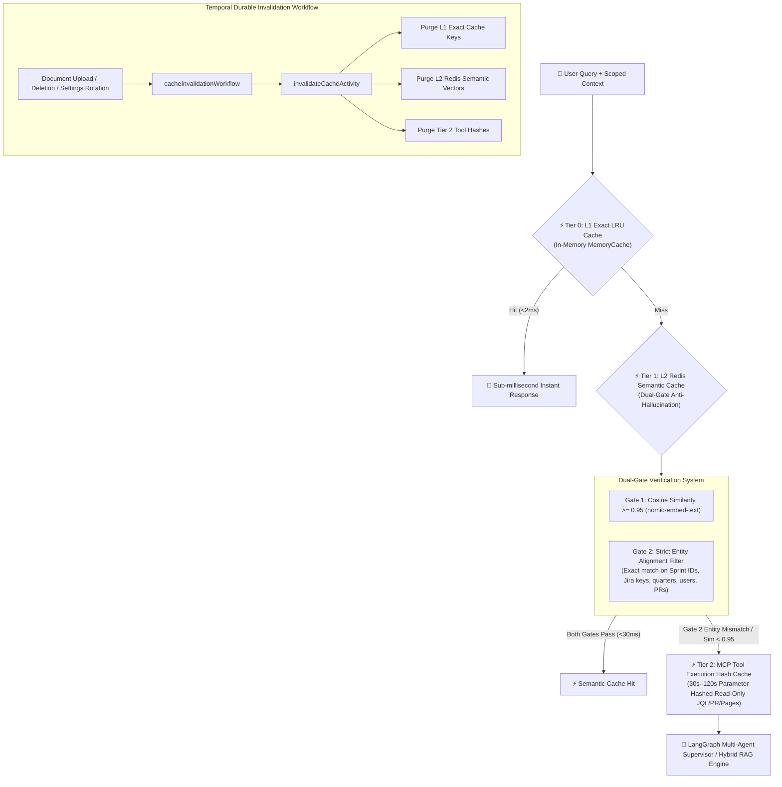

# ⚡ 5-Tier Production Caching Architecture & Temporal Invalidation

EM TaskFlow AI employs a **5-Tier Production Caching Architecture** engineered to eliminate redundant SLM inference latency, minimize GPU memory overhead, and ensure 100% data consistency via event-driven Temporal cache invalidations.

---

## 🏛️ Multi-Tier Architecture Overview

---

## 🔍 The 5 Caching Tiers Breakdown

### Tier 0: L1 In-Memory Exact LRU Cache (`l1ExactCache.js`)
- **Latency**: $<2\text{ms}$
- **Mechanism**: Normalized prompt hashing scoped by user, domain, and repository.
- **Eviction**: Least Recently Used (LRU) with a 500-entry capacity limit.

### Tier 1: L2 Redis Semantic Cache with Dual-Gate Verification (`semanticCache.js`)
- **Latency**: $<30\text{ms}$
- **Dual-Gate Verification**:
  - **Gate 1 (Vector Cosine Similarity $\ge 0.95$)**: Compares query vector embeddings generated by `nomic-embed-text`.
  - **Gate 2 (Strict Anti-Hallucination Entity Filter)**: Extracts and compares critical entities (e.g. Jira keys `ENG-1024`, Sprint names `Sprint 42`, quarters `Q3 2026`, GitHub PRs `PR #89`, engineer handles `@alex`). If entities differ, the cache hit is **rejected**, completely eliminating entity hallucination risks.
- **Domain-Adaptive TTLs**:
  - `rag` / `sop`: **7 Days** (Static architecture guidelines & policy docs)
  - `okr` / `roadmap`: **4 Hours** (Quarterly roadmap and goal alignment)
  - `dora` / `people`: **30 Minutes** (Engineering velocity & 1-on-1 cadences)
  - `sprint` / `delivery`: **2 Minutes** (Real-time Jira backlog & active PRs)

### Tier 2: MCP Tool Execution Hash Cache (`toolCache.js`)
- **Latency**: $<5\text{ms}$
- **Scope**: Hash-keyed caching for read-only Jira JQL searches, GitHub PR listings, Notion database queries, and Google Calendar events (30s–120s TTL).

### Temporal Event-Driven Invalidation (`cacheInvalidator.js`)
- Triggered automatically on document mutation, deletion, or settings rotation.
- Executes `cacheInvalidationWorkflow` to purge stale entries atomically across all tiers.
