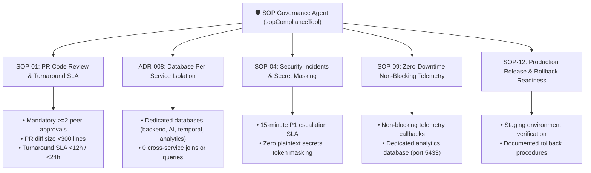

# 🛡️ Autonomous SOP & Architectural Governance Agent

The **SOP Compliance & Architectural Governance Agent** (`sopAgent.js`) acts as an automated governance auditor for Engineering Managers, validating PR code reviews, architectural proposals, security escalation procedures, and release workflows against internal Standard Operating Procedures (SOPs) and Architecture Decision Records (ADRs).

---

## 🏗️ Governance Dimensions Catalog

Located in [`backend/src/agent/sopAgent.js`](file:///Users/logsv/Documents/agent-dev/em-taskflow-ai/backend/src/agent/sopAgent.js):

---

## ⚡ Multi-Modal Execution Modes

The agent supports 4 specialized invocation modes:

| Mode | Purpose | Output Format |
| :--- | :--- | :--- |
| **`ANALYZE`** | Comprehensive compliance review | Single-pass executive summary, key document guidelines, compliance rubric table, and source citations. |
| **`LIST_RAW`** | Full policy catalog exploration | High-density Markdown table listing all active SOPs, ADRs, categories, and primary rules. |
| **`DRILL_DOWN`** | Focused audit or violation triage | Targeted analysis on violations (`target: 'VIOLATIONS'`) or specific categories (`target: 'ADRS'`). |
| **`CONCEPTUAL_ONLY`** | Policy guidance without live queries | Fast-path architectural advice based on cached governance knowledge. |

---

## 🛡️ Live Action Hub Matrix (`/actions?tab=sop`)

The SOP Compliance Agent surfaces real-time governance metrics in the EM Action Hub:
- **Compliance Rating**: Live percentage score (e.g. `100% COMPLIANT`).
- **Rule Statuses**: Active check statuses (`🟢 PASS`, `⚠️ WARN`, `🔴 FAIL`).
- **Impact Classifications**: `Critical`, `High`, or `Medium` business and technical impact ratings.
- **Verification Timestamps**: Timestamp of the latest automated audit run.
