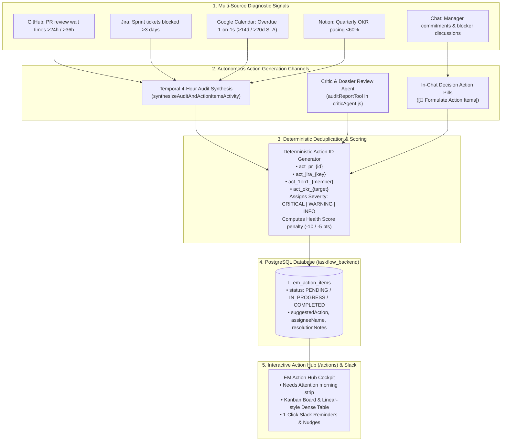

# 🎯 Autonomous Action Item Formulation & Creation

EM TaskFlow AI provides an autonomous **Action Item Formulation & Creation Engine** that converts disparate signals from GitHub PRs, Jira blocker tickets, Google Calendar 1-on-1s, Notion OKRs, and copilot chat conversations into tracked, stateful records in PostgreSQL.

---

## 🏗️ Architecture & Action Lifecycle

---

## 🔍 The 3 Action Creation Channels

### 1. Autonomous Background Audit Synthesis (`synthesizeAuditAndActionItemsActivity`)
Executed automatically on the 4-hour Temporal cron (`0 */4 * * *`) or on-demand via UI:
- **Delivery Bottlenecks**: Scans open PRs. Stalled PRs waiting $>24\text{h}$ generate `WARNING` items; $>36\text{h}$ generate `CRITICAL` items.
- **Jira Impediments**: Identifies sprint tickets blocked $>3\text{ days}$, routing them as delivery blocker items.
- **People & 1-on-1 Cadences**: Computes days elapsed since the last 1-on-1. Syncs overdue $>14\text{ days}$ generate `WARNING` items; $>20\text{ days}$ generate `CRITICAL` items.
- **Quarterly OKR Targets**: Flags at-risk key results pacing $<60\%$ against target deadlines.

### 2. In-Chat Action Formulation (`[🎯 Formulate Action Items]`)
During conversational sessions with the EM Copilot:
- The assistant identifies implicit blockers, review delays, or team growth action points.
- Renders an interactive **`[🎯 Formulate Action Items]`** decision action pill inline.
- Clicking the pill automatically parses the conversational context into structured items in `em_action_items` without manual data entry.

### 3. Critic & Report Audit Agent (`criticAgent.js` / `auditReportTool`)
- Evaluates draft weekly status reports, performance dossiers, and promotion nomination packets.
- Flags unquantified business claims, missing peer feedback, or unmitigated risks.
- Autonomously produces a structured **Remediation Action Checklist** for the manager.

---

## 🏷️ Deterministic Action Item IDs

To prevent duplicate records across recurring 4-hour cron runs:
- Pull requests: `act_pr_{prNumber}` (e.g. `act_pr_89`)
- Jira tickets: `act_jira_{issueKey}` (e.g. `act_jira_ENG_1024`)
- 1-on-1 meetings: `act_1on1_{memberEmailOrName}` (e.g. `act_1on1_sarah_chen`)
- Key results: `act_okr_{targetSlug}` (e.g. `act_okr_deploy_frequency`)

Existing items in `em_action_items` retain their current status (`IN_PROGRESS`, `COMPLETED`, `DISMISSED`) and resolution notes during subsequent audit runs.
