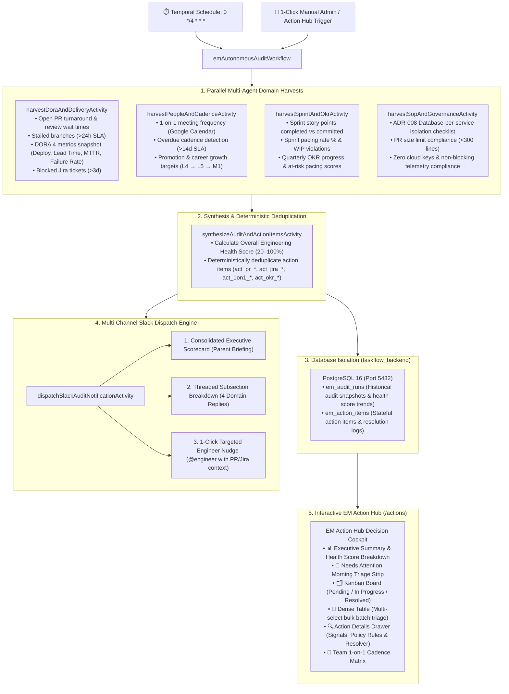

# ⏱️ Autonomous EM Task & Health Audit Engine

The **Autonomous Engineering Manager (EM) Task & Health Audit Engine** provides continuous background health auditing, automated multi-domain metric harvesting, multi-channel Slack notifications, and direct dispatch to the interactive **EM Action Hub** (`/actions`).

---

## 🏗️ Architecture Blueprint

The audit engine operates on a **4-Hour Durable Cron Schedule** (`0 */4 * * *`) powered by **Temporal**, executing parallel harvest activities across 10 domain micro-agents and multi-source MCP tools (GitHub, Jira, Notion, Google Calendar, and Slack).

---

## 💚 Engineering Health Score Formula

The overall Engineering Health Score is calculated deterministically based on active blockers, overdue SLAs, and governance violations:

$$\text{Health Score} = \max\left(20, \min\left(100, 100 - (10 \times N_{\text{critical}}) - (5 \times N_{\text{warning}})\right)\right)$$

### Penalty Triggers
- **🚨 Critical Penalty (-10 pts)**:
  - Pull requests waiting for review $>36\text{ hours}$.
  - 1-on-1 meeting overdue $>20\text{ days}$.
  - Jira tickets blocked in sprint $>3\text{ days}$.
  - ADR-008 per-service database isolation failure or cloud key leakage.
- **⚠️ Warning Penalty (-5 pts)**:
  - Pull requests waiting for review $>24\text{ hours}$ (PR review SLA).
  - 1-on-1 meeting overdue $>14\text{ days}$ (Bi-weekly sync SLA).
  - OKR pacing score $<60\%$ for active quarterly deliverables.
  - Sprint WIP limit violations.

---

## 💬 Multi-Channel Slack Dispatch Engine

The engine provides flexible Slack notification formats tailored for leadership and engineering teams:

### 1. Consolidated Executive Briefing (`mode: 'consolidated'`)
Sends a single high-impact scorecard message to `#engineering-leadership` or a configured target channel:
- **Health Score Pill**: `🟢 92/100 (Elite Performer)`
- **Core KPIs**: DORA Performer Tier (`Elite`), Sprint Pacing (`79%`), and SOP Compliance (`100%`)
- **Key Attention Items**: Overdue 1-on-1 count, stalled PR count, and top 4 prioritized action items with severity badges
- **Direct Deep-Link**: `<http://localhost:3000/actions|Open in EM Action Hub ↗>`

### 2. Threaded Subsection Breakdown (`mode: 'threaded_subsections'`)
Dispatches the Consolidated Executive Brief as the parent message, followed by 4 detailed threaded replies:
1. 🚀 **Delivery & DORA Metrics**: Open PR count, review wait times, MTTR, deployment frequency.
2. 👥 **People, 1-on-1s & Growth**: 1-on-1 cadence health, overdue syncs (>14d), career level targets.
3. 🎯 **Sprint Velocity & OKR Pacing**: Story points burn-down, pacing percentage, on-track vs at-risk objectives.
4. 🛡️ **SOP, ADR & Governance Compliance**: ADR-008 DB isolation status, PR size limits (<300 lines), zero cloud keys.

### 3. Targeted Engineer Action Item Nudges
Allows the Engineering Manager to click **"💬 Nudge"** on any action item card or table row in the UI to dispatch a targeted reminder to the assigned engineer on Slack (`@alex-dev`, `@sarah-c`) with context, PR/Jira links, and suggested talking points.

---

## 🛡️ In-Process Fallback Engine

If the Temporal server is offline or restarting:
1. The backend automatically switches to an in-process orchestration fallback (`teamSyncWorker.js` / async harvest handler).
2. The 4 domain harvests execute via Node.js `Promise.all()`.
3. Action items and health scores are persisted directly to PostgreSQL.
4. The user is informed via clear status indicators without API interruption.
