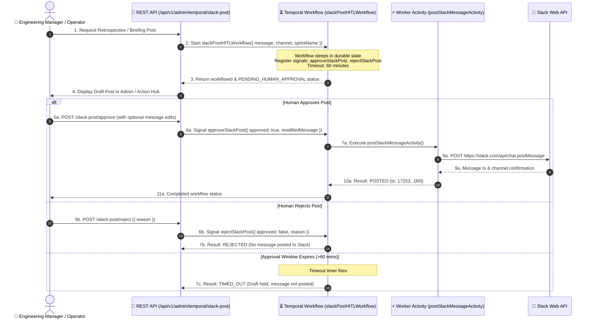

# 🤝 Durable Human-in-the-Loop (HITL) Workflows

EM TaskFlow AI implements durable **Human-in-the-Loop (HITL)** governance powered by **Temporal Workflows** for high-impact outbound communications, specifically automated retrospective summaries and leadership Slack broadcasts.

---

## 🎯 The Need for HITL Governance

While local SLMs excel at synthesizing data from GitHub, Jira, and Notion, publishing messages directly to public corporate channels without human review risks accidental tone misalignments, incorrect metric attributions, or noisy interruptions.

Temporal's durable state machine architecture allows the system to generate rich draft communications, put the workflow to sleep in an approval queue, and wait days or hours for human confirmation without consuming CPU resources.

---

## 🏗️ `slackPostHITLWorkflow` Execution Lifecycle



---

## ⚙️ Signal Definitions & Code Example

Located in [`backend/src/temporal/workflows.js`](file:///Users/logsv/Documents/agent-dev/em-taskflow-ai/backend/src/temporal/workflows.js):

```javascript
import { proxyActivities, defineSignal, setHandler, condition } from '@temporalio/workflow';

export const approveSlackPostSignal = defineSignal('approveSlackPost');
export const rejectSlackPostSignal = defineSignal('rejectSlackPost');

export async function slackPostHITLWorkflow(params = {}) {
  const { channel = '#engineering-retro', message = '', timeoutMinutes = 60 } = params;

  let isApproved = false;
  let isRejected = false;
  let approvalPayload = null;

  // 1. Register signal handlers
  setHandler(approveSlackPostSignal, (payload) => {
    isApproved = true;
    approvalPayload = payload || {};
  });

  setHandler(rejectSlackPostSignal, (payload) => {
    isRejected = true;
  });

  // 2. Wait for signal or timeout
  const receivedSignal = await condition(
    () => isApproved || isRejected,
    `${timeoutMinutes} minutes`
  );

  if (!receivedSignal) return { status: 'TIMED_OUT', posted: false };
  if (isRejected) return { status: 'REJECTED', posted: false };

  // 3. Dispatch approved message (incorporating human edits if provided)
  const finalMessage = approvalPayload?.modifiedMessage || message;
  const postResult = await activities.postSlackMessageActivity({
    channel: approvalPayload?.targetChannel || channel,
    message: finalMessage,
    approver: approvalPayload?.approver || 'Engineering Manager',
  });

  return { status: 'POSTED', posted: true, postResult };
}
```

---

## 📡 REST API Management Endpoints

| Method | Canonical Endpoint | Purpose |
| :--- | :--- | :--- |
| `POST` | `/api/v1/admin/temporal/slack-post/request` | Initiates a draft Slack post in the Temporal HITL queue. |
| `POST` | `/api/v1/admin/temporal/slack-post/approve` | Dispatches approval signal (with optional edited message). |
| `POST` | `/api/v1/admin/temporal/slack-post/reject` | Dispatches rejection signal and cancels message delivery. |
| `GET` | `/api/v1/admin/temporal/slack-post/status?workflowId=...` | Queries current workflow execution state and close status. |
