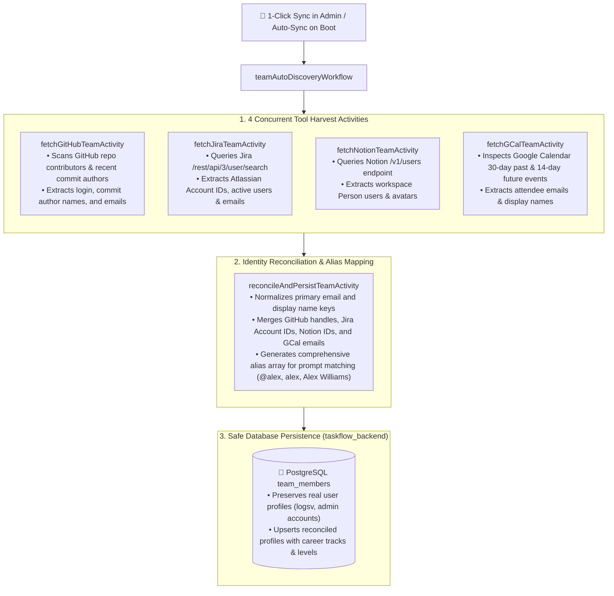

# 👥 Cross-Platform Team Auto-Discovery & Reconciliation

EM TaskFlow AI features an autonomous **Team Auto-Discovery & Cross-Source Identity Reconciliation Workflow** powered by **Temporal** (`teamAutoDiscoveryWorkflow`) and an in-process background worker (`teamSyncWorker.js`).

---

## 🎯 The Cross-Platform Identity Problem

In enterprise environments, engineers often operate under different handles and emails across various tools:
- **GitHub**: `@alex-dev` (Username), `alex.w@users.noreply.github.com`
- **Jira**: `alex.williams@company.internal` (Atlassian Account ID `557058:ba...`)
- **Notion**: `Alex Williams` (Notion Person ID `b3f...`)
- **Google Calendar**: `alex.williams@company.internal` (Event attendee email)

Without identity reconciliation, DORA metrics, sprint allocations, and 1-on-1 cadences become fragmented across disparate profiles.

---

## 🏗️ 4-Way Parallel Discovery Architecture

---

## 🔒 Real User & Primary Admin Identity Preservation Rule

To eliminate accidental identity wipes during test fixture cleanup, mock data resets, or test suite runs:
- **Rule of Real User Immunity**: Real user profiles (e.g. `logsv`, configured primary admin emails, and lead engineering managers) are strictly protected.
- **`app_settings` Immunity**: API tokens and live keys configured in `app_settings` are never truncated or wiped.
- When `reconcileAndPersistTeamActivity` runs, it dynamically ensures the primary administrator profile is preserved and prioritized with proper `M1_EM` track configuration.

---

## 📡 REST API & Admin Portal Operations

Operators can inspect and trigger team discovery via the **Admin Portal (`/admin?tab=team`)** or the following canonical API endpoints:

| Endpoint | Method | Description |
| :--- | :--- | :--- |
| `/api/v1/admin/team` | `GET` | Lists all reconciled team members, levels (`L4_MID`, `L5_SENIOR`, `M1_EM`), aliases, and tool IDs. |
| `/api/v1/admin/team/sync` | `POST` | Triggers 1-click 4-way parallel auto-discovery via Temporal workflow or worker. |
| `/api/v1/admin/team/sync/status` | `GET` | Queries background team sync worker state and last completion timestamp. |
| `/api/v1/admin/team` | `POST` | Adds a team member manually with custom tool handles and career level target. |
| `/api/v1/admin/team/:id` | `PUT` | Updates an existing team member's career level, track, or aliases. |
| `/api/v1/admin/team/:id` | `DELETE` | Removes a team member profile. |
