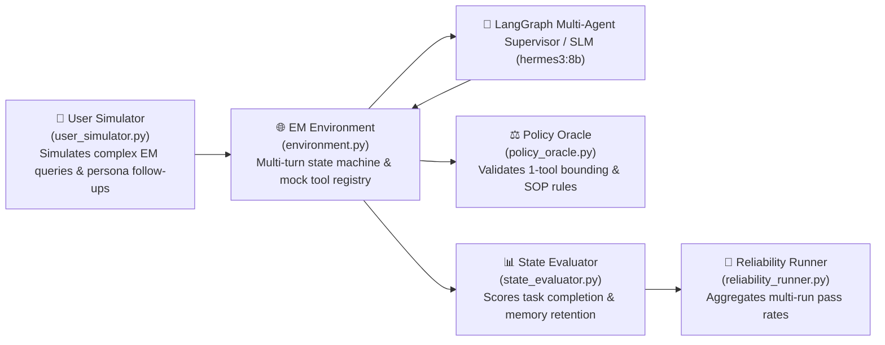

# 🧪 EM Tau-Bench Multi-Turn Simulation Framework

Located in [`services/python-ai-service/evaluation/em_tau_bench/`](file:///Users/logsv/Documents/agent-dev/em-taskflow-ai/services/python-ai-service/evaluation/em_tau_bench/), **EM Tau-Bench** is a specialized benchmark environment for evaluating multi-turn conversational trajectories, goal convergence, policy compliance, and tool-use reliability across Engineering Manager workflows.

---

## 🏗️ Architecture Components

---

## 🔍 Evaluated Dimensions

1. **Goal Completion Rate**: Did the multi-agent system successfully resolve the multi-turn management scenario (e.g. formulate SBI feedback, compute sprint capacity with PTO deductions, and flag stalled PRs)?
2. **Policy Adherence**: Did the agent respect the 1-tool sub-agent constraint and avoid unapproved cloud endpoints?
3. **Session Fact-Matrix Retention**: Did the agent correctly remember DORA baselines, engineer aliases, and ticket keys across 5+ conversational turns without hallucinations?
4. **Trajectory Efficiency**: Did the supervisor minimize unnecessary intermediate transitions and prevent agent looping?
