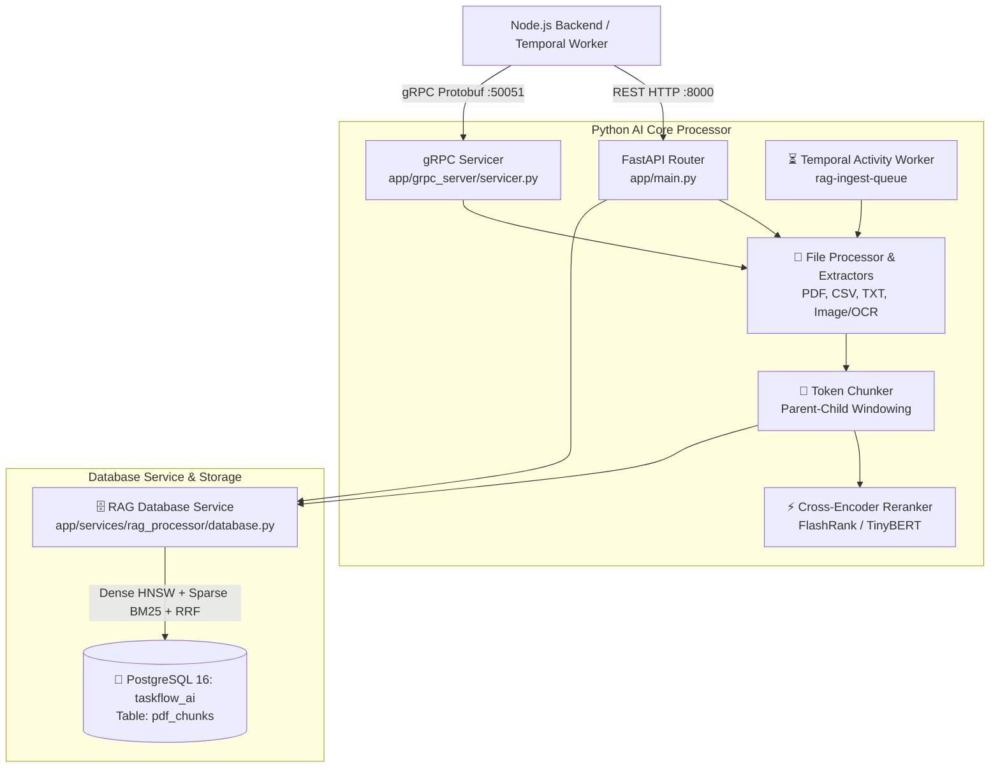
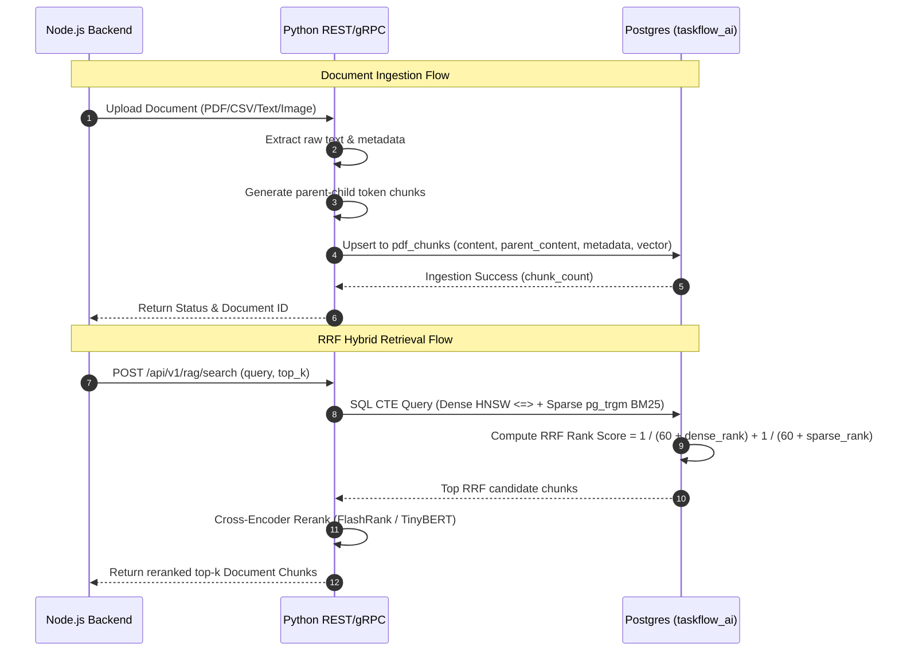

# 🐍 EM TaskFlow AI - Python AI Service

> **Python 3.12 gRPC & REST Microservice powering 100% local parent-child document chunking, Cross-Encoder reranking, SQL CTE Reciprocal Rank Fusion (RRF) hybrid search, and Temporal durable workflow activities.**

---

## 📑 Table of Contents
- [🏛️ System Architecture](#️-system-architecture)
- [🔄 Ingestion & Retrieval Sequence Flow](#-ingestion--retrieval-sequence-flow)
- [🧩 Subsystem Breakdown](#-subsystem-breakdown)
- [⚙️ Database Isolation & Vector Schema](#️-database-isolation--vector-schema)
- [📡 API & gRPC Reference](#-api--grpc-reference)
- [📁 Project Structure](#-project-structure)
- [🧪 Testing & Verification](#-testing--verification)

---

## 🏛️ System Architecture

The Python AI Service operates as a dual-protocol microservice listening on **Port 8000 (FastAPI REST)** and **Port 50051 (gRPC)**. It is isolated to its dedicated database `taskflow_ai` on PostgreSQL 16.



---

## 🔄 Ingestion & Retrieval Sequence Flow



---

## 🧩 Subsystem Breakdown

### 1. Document Extraction Pipeline (`app/services/file_processor/`)
- **PDF Processor**: `pdf_extractor.py` extracts formatted text and embedded images.
- **CSV & Sheet Processor**: `csv_extractor.py` converts tabular data into structured Markdown tables.
- **Image & OCR Processor**: Multi-modal vision extraction supporting OCR and `qwen3-vl` embeddings.
- **Text & Code Processor**: Plain text and code file parser.

### 2. Parent-Child Token Chunker (`app/services/rag_processor/chunker.py`)
- Computes token-aware text chunks (default 512 tokens with sliding overlap).
- Preserves **parent windowing context** (`parent_content`) for every child chunk to ensure complete semantic context during LLM prompt generation.

### 3. Reciprocal Rank Fusion (RRF) Engine (`app/services/rag_processor/database.py`)
Executes an SQL CTE query combining dense vector distance and sparse full-text search:

```sql
WITH dense_search AS (
    SELECT id, ROW_NUMBER() OVER (ORDER BY embedding <=> %s::vector) AS rank
    FROM pdf_chunks ORDER BY embedding <=> %s::vector LIMIT 60
),
sparse_search AS (
    SELECT id, ROW_NUMBER() OVER (ORDER BY ts_rank_cd(to_tsvector('english', content), query) DESC) AS rank
    FROM pdf_chunks, plainto_tsquery('english', %s) query
    WHERE to_tsvector('english', content) @@ query LIMIT 60
)
SELECT p.id, p.content, COALESCE(p.parent_content, p.content) AS parent_content, p.metadata,
       COALESCE(1.0 / (60 + d.rank), 0.0) + COALESCE(1.0 / (60 + s.rank), 0.0) AS rrf_score
FROM dense_search d FULL OUTER JOIN sparse_search s ON d.id = s.id
JOIN pdf_chunks p ON p.id = COALESCE(d.id, s.id)
ORDER BY rrf_score DESC LIMIT %s;
```

### 4. Cross-Encoder Reranker (`app/services/rag_processor/reranker.py`)
- Reranks candidate document chunks retrieved by RRF using a lightweight local Transformer cross-encoder model to maximize contextual precision.

### 5. Durable Temporal Ingestion Activities (`app/temporal/activities.py`)
- Registers durable activity handlers on task queue `rag-ingest-queue` for background document ingestion, chunking, and vector persistence.

---

## ⚙️ Database Isolation & Vector Schema

The Python AI Service connects exclusively to **`taskflow_ai`** on `postgres:5432`:

```sql
CREATE TABLE IF NOT EXISTS pdf_chunks (
    id SERIAL PRIMARY KEY,
    filename TEXT NOT NULL,
    chunk_index INT NOT NULL,
    content TEXT NOT NULL,
    parent_content TEXT,
    metadata JSONB DEFAULT '{}'::jsonb,
    embedding vector(768),
    created_at TIMESTAMP WITH TIME ZONE DEFAULT CURRENT_TIMESTAMP
);

-- HNSW Cosine Similarity Vector Index
CREATE INDEX IF NOT EXISTS idx_pdf_chunks_embedding 
ON pdf_chunks USING hnsw (embedding vector_cosine_ops);

-- Trigram BM25 Full-Text Search Index
CREATE INDEX IF NOT EXISTS idx_pdf_chunks_fts 
ON pdf_chunks USING gin (content gin_trgm_ops);
```

---

## 📡 API & gRPC Reference

### REST Endpoints (Port 8000)
- **`GET /health`**: Health check status of RAG pipeline and DB connection.
- **`POST /api/v1/extract`**: Extract raw text and metadata from document file payload.
- **`POST /api/v1/rag/chunk`**: Tokenize text into parent-child chunks.
- **`POST /api/v1/rag/search`**: Execute RRF hybrid vector search against `taskflow_ai`.
- **`POST /api/v1/rag/rerank`**: Perform Cross-Encoder reranking on candidate chunks.
- **`GET /api/v1/rag/documents`**: List all ingested document filenames and chunk statistics.
- **`DELETE /api/v1/rag/documents/:filename`**: Remove document and its vector chunks.

### gRPC Endpoints (Port 50051)
- **`ExtractDocument`**: High-performance binary protobuf document extraction.
- **`ProcessRAGIngestion`**: Ingest document into `taskflow_ai` vector database.
- **`RerankChunks`**: gRPC Cross-Encoder reranking RPC.

---

## 📁 Project Structure

```
services/python-ai-service/
├── app/
│   ├── main.py                     # FastAPI application entrypoint (REST)
│   ├── config.py                   # Service environment configuration
│   ├── grpc_server/                # gRPC servicer & proto definitions
│   │   ├── servicer.py
│   │   └── rag_service_pb2.py
│   ├── services/
│   │   ├── file_processor/         # PDF, CSV, TXT, OCR document extractors
│   │   └── rag_processor/          # Chunker, Reranker, & DB Service (SQL CTE RRF)
│   ├── temporal/                   # Temporal durable activities & worker setup
│   └── telemetry/                  # OpenTelemetry & JSON logging formatters
├── evaluation/                     # EM Tau-Bench user simulator, DeepEval Hermes judge, Ragas, TruLens
├── tests/                          # Pytest integration & unit test suite (48 specs)
├── pyproject.toml                  # Python dependencies (uv / pip)
├── pytest.ini                      # Pytest configuration
├── Dockerfile                      # Production Docker build container
└── README.md                       # Python AI Service documentation
```

---

## 🧪 Testing & Verification

Run the full **48 pytest specs**:
```bash
cd services/python-ai-service
uv run pytest
```

Run specialized evaluation sub-suites:
```bash
# DeepEval agent trajectory benchmarks (12 GEval specs)
uv run pytest tests/test_deepeval_agent_trajectories.py

# EM Tau-Bench multi-turn user simulation (5 personas)
uv run pytest tests/test_em_tau_bench.py
```

